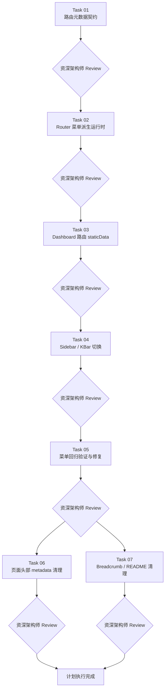

# Route StaticData Navigation Migration Implementation Plan

> **For Claude:** Use `${SUPERPOWERS_SKILLS_ROOT}/skills/collaboration/executing-plans/SKILL.md` to implement this plan task-by-task.

**Goal:** 将后台导航相关配置从 `src/config/nav-config.ts` 迁移到各路由文件的 `staticData` 中，并让侧边栏、KBar 与后续页面元信息都从 Router 派生，形成文件级单一事实来源。

**Architecture:** 在 `src/lib/router/` 下定义项目专用的 `AppRouteStaticData` 契约，所有可见 dashboard 路由就地声明自己的导航、文档标题、面包屑与可选页面头部信息。运行时通过 `useRouter().routesById` 派生菜单树，通过 `useMatches()` 消费激活路由元数据；`head().meta` 继续只负责文档元信息，但文档标题必须从同一份 `staticData` 常量派生。父子菜单关系不依赖“源码扫描”或“模糊路径前缀”，而是优先使用显式 `nav.parentId`；这是必要的，因为当前 TanStack file route 生成结果里，`/dashboard/forms/*` 与 `/dashboard/forms/` 并不是树上的父子节点。

**Tech Stack:** React 19、TypeScript、TanStack Router v1、TanStack Start、kbar、Shadcn UI

---

## 执行治理

- 本计划已经拆分为 7 个独立 task 文档；执行时只允许按拓扑顺序进入下游 task。
- 每个 task 完成后，开发者必须先完成该 task 文档内的验证步骤，再向资深架构师发起 review。
- 只有在资深架构师明确给出“通过”结论后，才允许开始下一个 task。
- 若 review 要求修复，修复后必须复验并再次发起 review；未通过前不得进入下游 task。
- 若进入并行分支，分支内每个 task 都必须单独 review；汇合点只有在所有上游分支均 review 通过后才能打开。
- 本次只做计划拆分，不执行任何实现任务。

## 任务文档索引

1. [Task 01: 定义项目级路由元数据契约](./2026-05-22-route-staticdata-navigation-migration/task-01-app-route-static-data-contract.md)
2. [Task 02: 实现从 Router 派生菜单树的运行时](./2026-05-22-route-staticdata-navigation-migration/task-02-route-nav-runtime.md)
3. [Task 03: 给 dashboard 路由补齐 `staticData`](./2026-05-22-route-staticdata-navigation-migration/task-03-dashboard-route-static-data.md)
4. [Task 04: 切换侧边栏和 KBar 到路由派生数据](./2026-05-22-route-staticdata-navigation-migration/task-04-sidebar-kbar-switch.md)
5. [Task 05: 补齐行为验证并处理菜单回归](./2026-05-22-route-staticdata-navigation-migration/task-05-navigation-regression-verification.md)
6. [Task 06: 第二阶段清理页面头部信息来源](./2026-05-22-route-staticdata-navigation-migration/task-06-page-header-metadata-cleanup.md)
7. [Task 07: 清理无效 breadcrumb 代码与文档](./2026-05-22-route-staticdata-navigation-migration/task-07-breadcrumb-readme-cleanup.md)

## Task 摘要

- `Task 01`：建立 `AppRouteStaticData` 契约、缩窄 helper、`NavItem` 类型边界。
- `Task 02`：实现 `buildNavGroupsFromRoutes()`，把菜单派生逻辑从中心配置迁到 Router 运行时。
- `Task 03`：给 dashboard 路由逐个补齐 `staticData`，并让 `head().meta` 从 route-local 常量派生。
- `Task 04`：让 sidebar / KBar 改为消费路由派生数据，并删除 `src/config/nav-config.ts`。
- `Task 05`：完成菜单相关的行为验证与回归修复；这是 Task 04 的连续执行波次。
- `Task 06`：把页面头部文案、描述、`infoContent` 等默认来源进一步收口到 route metadata。
- `Task 07`：清理 breadcrumb hook 与 README 中过期的导航配置说明。

## 执行拓扑图

## 并行规则

- `Task 01` 到 `Task 05` 必须严格串行。
- `Task 04` 与 `Task 05` 属于同一变更波次，执行时不得插入其他 task。
- `Task 06` 与 `Task 07` 在 `Task 05` review 通过后可以并行。
- 若只有一个开发者，推荐线性顺序仍为：`01 → 02 → 03 → 04 → 05 → 07 → 06`。

## 汇合规则

- `Task 06` 与 `Task 07` 若并行执行，则两者都必须通过资深架构师 review，才能宣布本计划完成。
- 若 `Task 06` 或 `Task 07` 任一分支 review 未通过，另一分支即使已完成，也不得关闭总计划。

## 全局完成定义

满足以下条件才算迁移完成：

- `src/config/nav-config.ts` 已删除。
- 侧边栏与 KBar 都从路由 `staticData` 派生。
- `head().meta` 不再手写重复标题字符串，而是从 route-local `staticData` 常量派生。
- “表单”仍然是可展开容器菜单。
- “通知”仍位于“账户”视觉分组。
- 构建、lint、格式检查全部通过。
- 所有 task 均已通过资深架构师 review。

## 风险总览

- `staticData` 类型若没有统一 chokepoint，后续很容易漂移。
- 容器路由与重定向路由若混淆，菜单会出现“可见但错误跳转”的行为。
- KBar action id 若继续用标题，未来路由重名时会冲突。
- `nav.parentId` 是显式耦合点，若父容器重命名，子路由必须同步更新；执行时必须依赖 invariant 检查让错误尽早暴露。

## 执行入口

- 进入任一 task 前，先打开对应 task 文档。
- 完成 task 后，按该 task 文档中的“资深架构师 Review Gate”执行。
- 本总控文档只负责拓扑、治理和入口，不再重复每个 task 的详细实施步骤。

### Update (2026-05-25)

- 实现状态：`Task 01` 至 `Task 07` 均已完成并通过资深架构师 review；其中 `Task 06` 与 `Task 07` 按拓扑图并行执行后收敛
- 依赖关系状态：串行主链 `01 → 02 → 03 → 04 → 05` 已完成，`Task 05` 成功解锁并行分支，`Task 06` / `Task 07` 均已闭环
- 验证状态：`npm run build` 与 `npm run lint` 已通过；仓库级 `npm run format:check` 仍受无关既有文件的格式基线影响，尚未满足原始“格式检查全部通过”的全局完成定义
