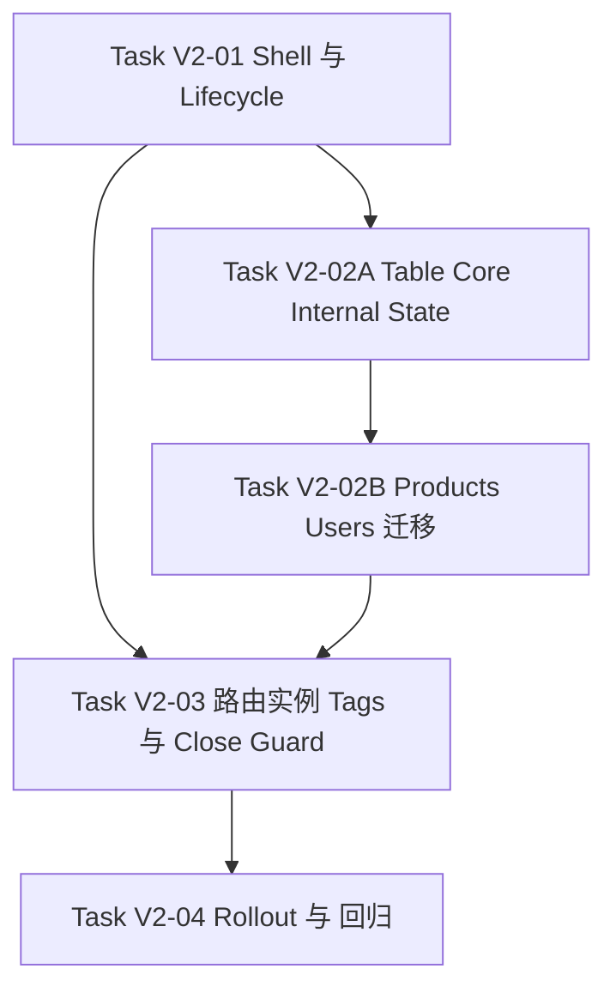

# Workspace Tabs V2: 轻壳 Tags + Activity Host + Feature-Local State

**Supersedes:** `docs/plans/2026-05-26-workspace-tabs-activity-keepalive/spec/*`
**Status:** `draft for review`

## Goal

用更轻的 workspace shell 替代 v1 的 route-state / adapter / definition 方向，把 dashboard 收敛为：

- `TagsBar` 负责实例化与切换页面标签
- React 19 `<Activity>` 负责 keep-alive 整个 page/screen 子树实例
- feature 自己维护 table / form / page 的内部状态

v2 的重点不是“把 URL/search state 做得更通用”，而是把 workspace 壳做薄，把页面状态留在页面内部，把保活粒度提升为完整页面实例。

## Product Constraints

以下约束来自产品明确决策，v2 不允许偏离：

1. URL 不再作为表格分页 / 筛选 / 排序的通用状态源；分享 URL 与刷新恢复都不是通用目标。
2. 表格状态必须内部维护；page 只负责挂载 table，`perPage` 只从 session/local preference 初始化。
3. keep-alive 方案以 React 19 `<Activity>` 为核心；不要再依赖 `WorkspaceRouteDefinition`、`searchAdapter`、`workspace-definition`。
4. 若保留 tags keep-alive，应保的是整个 screen/page 子树实例，而不是 table 的派生状态。
5. 旧版 spec 已被执行，不能原地改写；v2 必须新增在同目录下，并明确 v1 方向作废。

## Architecture

### 1. Workspace Shell

`WorkspaceShell` 只保留三类职责：

- 管理 tab 列表、激活项和关闭动作
- 通过 `<Activity>` 托管整个 page 子树实例
- 统一协调 `dirty` / `closeGuard` 关闭拦截

shell 不再承担以下职责：

- 不持有 table/search/filter/sort/page 等业务状态
- 不做 URL <-> state 转译
- 不通过通用 adapter 向 feature 注入搜索状态
- 不理解 query key、列表过滤器或分页逻辑

### 2. Page Boundary

每个 dashboard route 通过一个很薄的 `WorkspacePageBoundary` 接入 shell，默认：

- `keepAlive = true`
- `closable = true`
- `tabId = pathname`

详情页 / 新建页按完整路由实例开新 tag，例如：

- `/dashboard/product/new`
- `/dashboard/product/123`
- `/dashboard/product/456`

三者都是不同实例。

页面可显式声明极小 lifecycle：

- `title`
- `dirty`
- `closeGuard`

除此之外，shell 不应再要求页面实现任何状态协议。

### 2.1 Render Ownership Contract

v2 明确采用“host 唯一持有页面实例”的模型，避免 route 直渲染和 `ActivityHost` 双挂载同一页面实例：

- flag-on 时，页面实例的唯一 owner 是 `ActivityHost`
- route component 只负责计算 descriptor、注册 lifecycle、提供 fallback 元数据，不直接渲染 screen/page
- `WorkspacePageBoundary` 在注册完成后返回 `null`，最终页面实例只在 `WorkspaceViewport -> ActivityHost` 内 mount
- `keepAlive=true` 页面在 deactive 后进入 `<Activity mode="hidden">`
- `keepAlive=false` 页面在 flag-on 下仍由 `ActivityHost` 持有，但只渲染 active slot；一旦 deactive 立即 unmount，不进入 hidden host
- flag-off 时，route 恢复为单页直渲染 owner，完全绕过 v2 host

不接受“route 先直渲染，再切给 host”的中转方案。只要存在一次真实页面实例的双 mount、双请求或表单重建窗口，该实现就不符合 v2。

### 2.2 Ownership Timeline

```text
flag-on, route match
  -> route 计算 tabId / initialTitle / keepAlive / page component / fallback
  -> WorkspacePageBoundary register(descriptor)
  -> WorkspacePageBoundary render null
  -> WorkspaceViewport 在同一导航周期读取 active tab descriptor
  -> ActivityHost mount page subtree exactly once
  -> 若 active descriptor 尚未就绪，host 必须渲染非空 pending fallback；不允许出现空白 viewport 帧

title/dirty/closeGuard 更新
  -> page 内部调用 useWorkspacePage(update)
  -> store 更新 lifecycle snapshot
  -> TagsBar / close actions 消费最新 snapshot

flag-on, route unmatch while tab still opened
  -> route boundary unmount
  -> 只释放“当前 URL 命中”关系，不清理 opened tab descriptor
  -> shell store 继续持有 descriptor / lifecycle snapshot
  -> keepAlive=true 页面继续 hidden；keepAlive=false 页面虽已 unmount，但 descriptor 仍保留给后续重新激活

slot 缺失或页面 render error
  -> ownership 仍归 ActivityHost
  -> ActivityHost 渲染 descriptor.errorFallback 或通用 workspace fallback
  -> route 不接管页面实例，不补一次直渲染

flag-on, keepAlive=false page deactive
  -> ActivityHost unmount active subtree immediately
  -> route 不补直渲染
  -> 下次重新激活时仍由 ActivityHost 重新 mount

flag-off
  -> route 直接渲染 page
  -> WorkspacePageBoundary / ActivityHost / tags store 全链路不参与
```

### 2.3 Minimal Interface Sketch

```ts
type WorkspaceCloseReason = 'close-current' | 'close-other' | 'close-all';

type WorkspaceCloseGuard = (context: {
  tabId: string;
  reason: WorkspaceCloseReason;
}) => boolean | Promise<boolean>;

type WorkspacePageDescriptor = {
  tabId: string;
  initialTitle: string;
  keepAlive?: boolean;
  closable?: boolean;
  render: () => React.ReactNode;
  errorFallback?: React.ReactNode;
};

type WorkspacePageLifecycle = {
  title?: string;
  dirty?: boolean;
  closeGuard?: WorkspaceCloseGuard;
};

declare function WorkspacePageBoundary(props: WorkspacePageDescriptor): null;

declare function useWorkspacePage(): {
  tabId: string;
  updateLifecycle: (patch: WorkspacePageLifecycle) => void;
};
```

接口约束：

- `register` 在 boundary mount 时发生一次；descriptor 变化时允许 `updateDescriptor`
- `updateLifecycle` 可被页面多次调用，只更新 `title / dirty / closeGuard`
- route unmount 只表示“当前 URL 不再命中该 tab”，不能清理仍处于 opened tabs 中的 descriptor
- descriptor 一旦注册，就转交 shell store 持有；`ActivityHost` 与 `useWorkspacePage()` 都只读写 store 持有的 channel
- 只有 tab 被成功关闭，或 workspace shell 被整体 reset（例如 flag-off 切换、整页 reload / app dispose）时，才允许最终 cleanup descriptor / lifecycle
- lifecycle 更新不能触发页面实例重建，只能更新 store snapshot

### 2.4 Descriptor Lifetime Contract

v2 把“route 发现当前 URL”与“opened tab 生命周期”明确拆成两层：

- route boundary 的 mount/unmount 只负责发现或刷新“当前 URL 对应的 descriptor”
- descriptor 注册后由 shell store 接管持有，不再跟随 route boundary 的 mount 状态生死绑定
- route unmatch 不能清掉仍处于 opened tabs 中的 descriptor
- `useWorkspacePage(updateLifecycle)` 依赖的是 `ActivityHost` 注入的 store-backed channel；只要 tab 仍处于 opened 状态，该 channel 就有效
- tab close 是唯一允许触发业务级最终 cleanup 的事件；flag-off / reload 这类全局 reset 则作为壳层级别的整体验收清理

### 3. Feature-Local State

page 内部状态完全由 feature 自己维护：

- table 分页 / 筛选 / 排序是 table 的内部状态
- 表单草稿、临时 UI 状态、选中项都保存在 page 子树内部
- `perPage` 只在初始化时读取 preference，再由 table 自己维护

由于 `<Activity>` 保的是整个 page 实例，切换 tags 时这些状态会自然保留，不需要再设计通用 `route-state` 层。

### 4. URL Policy

v2 只保留两类 URL 使用方式：

- 路由身份：决定当前 page 实例和 `tabId`
- feature 特例：极少数页面若确有 URL 状态需求，单独实现 feature-specific hook

URL 明确不再承担 table 通用状态源角色。

默认 `tabId` 只由完整路由实例身份决定，即 `pathname + params`；search 不参与通用实例身份计算。若某个 feature 确实需要把 URL 的一部分纳入实例身份，必须局部显式声明，不能反向扩展成全局框架。

### 4.1 Table Internal-State API Boundary

v2 下 `useDataTable` 的默认契约是“内部状态优先”，最小外部能力只允许消费方读写 table 自己的状态快照，不允许把 router search 重新塞回来：

```ts
type DataTableStateSnapshot = {
  pagination: { pageIndex: number; pageSize: number };
  sorting: SortingState;
  columnFilters: ColumnFiltersState;
};

type DataTableController = {
  state: DataTableStateSnapshot;
  setPagination: (updater: PaginationState | Updater<PaginationState>) => void;
  setSorting: (updater: SortingState | Updater<SortingState>) => void;
  setColumnFilters: (updater: ColumnFiltersState | Updater<ColumnFiltersState>) => void;
  reset: () => void;
};
```

边界规则：

- controller 由 table hook 自己持有
- page 只消费 controller，不承担状态宿主
- `perPage` 只影响初始 `pageSize`
- 若 feature 需要 URL 例外能力，应在 feature 内再包一层专用 hook，而不是扩展全局 controller

### 4.2 Target Ergonomics Examples

以下示例不是“实现草稿”，而是 v2 落地后应达到的目标调用形态。

如果最终 API 比下面明显更重，仍然需要 route-state / adapter / definition 才能工作，说明设计反弹，应继续收缩。

#### 示例 A：普通页面

普通 dashboard 页面只需要声明一个 `WorkspacePageBoundary`，shell 不介入任何业务状态：

```tsx
export const Route = createFileRoute('/dashboard/overview')({
  component: OverviewRoute
});

function OverviewRoute() {
  return (
    <WorkspacePageBoundary
      tabId='/dashboard/overview'
      initialTitle='仪表盘'
      render={() => <OverviewPage />}
    />
  );
}

function OverviewPage() {
  return <PageContainer>{/* page content */}</PageContainer>;
}
```

目标约束：

- route 只声明“这是一个 workspace page”
- 不需要 `WorkspaceRouteDefinition`
- 不需要 `parse / stringify / buildHref`
- 不需要 `searchAdapter`

#### 示例 B：列表页

列表页的 table 自己维护分页 / 筛选 / 排序，page 只消费 table controller，并直接把 controller state 送入 query：

```tsx
export const Route = createFileRoute('/dashboard/product/')({
  component: ProductsRoute
});

function ProductsRoute() {
  return (
    <WorkspacePageBoundary
      tabId='/dashboard/product'
      initialTitle='产品'
      render={() => <ProductsPage />}
    />
  );
}

function ProductsPage() {
  const { table, controller } = useDataTable({
    columns,
    initialState: {
      // 实际实现里由 data-table page-size utility 提供 seed
      pagination: { pageIndex: 0, pageSize: 50 }
    }
  });

  const filters = {
    page: controller.state.pagination.pageIndex + 1,
    limit: controller.state.pagination.pageSize,
    sorting: controller.state.sorting,
    columnFilters: controller.state.columnFilters
  };

  const { data } = useSuspenseQuery(productsQueryOptions(filters));

  return (
    <PageContainer>
      <DataTableToolbar table={table} />
      <ProductTable
        table={table}
        rows={data.products}
        pageCount={Math.ceil(data.total_products / controller.state.pagination.pageSize)}
      />
    </PageContainer>
  );
}
```

目标约束：

- table 状态源就是 `controller.state`
- query 直接消费 table state
- page 和 shell 都不是 table 状态宿主
- URL 不是列表页通用状态来源

#### 示例 C：脏表单页

只有在页面确实需要 runtime title / dirty / closeGuard 时，才额外调用 `useWorkspacePage()`：

```tsx
function ProductEditPage() {
  const { updateLifecycle } = useWorkspacePage();
  const [draft, setDraft] = useState(initialDraft);

  useEffect(() => {
    const dirty = isDraftDirty(draft);

    updateLifecycle({
      title: draft.name || '新建产品',
      dirty,
      closeGuard: async () => {
        if (!dirty) return true;
        return await confirmDiscardChanges();
      }
    });
  }, [draft, updateLifecycle]);

  return <ProductForm value={draft} onChange={setDraft} />;
}
```

目标约束：

- shell 只暴露 `updateLifecycle`
- 页面自己判断是否 dirty
- shell 不理解表单草稿结构，不接管业务文案

#### 示例 D：多实例详情页

详情页 / 新建页通过 route identity 直接形成不同 tag，不需要额外的 tab factory：

```tsx
export const Route = createFileRoute('/dashboard/product/$productId')({
  component: ProductDetailRoute
});

function ProductDetailRoute() {
  const { productId } = Route.useParams();

  return (
    <WorkspacePageBoundary
      tabId={`/dashboard/product/${productId}`}
      initialTitle={productId === 'new' ? '新建产品' : `产品 ${productId}`}
      render={() => <ProductDetailPage productId={productId} />}
    />
  );
}
```

目标约束：

- `/dashboard/product/new`
- `/dashboard/product/123`
- `/dashboard/product/456`

三者是不同实例，不共享页面状态。

#### 简洁性验收标准

如果 v2 落地后的调用形态不能满足下面 3 条，就说明设计仍然过重：

- 普通页面只需要 `WorkspacePageBoundary`
- 脏页面只额外调用 `useWorkspacePage().updateLifecycle`
- 列表页只关心 `useDataTable + query`，不需要知道 shell、adapter、definition、route-state 的存在

## Non-Goals

v2 首轮不做以下事情：

- 不恢复浏览器硬刷新前打开的 tags 列表
- 不恢复跨刷新 page 内部状态
- 不在本轮物理删除 `src/lib/page-cache/*` 与 v1 抽象；只退出主链路并标注 deprecated / superseded
- 不为“极少数需要 URL 状态的页面”同时设计通用框架

## Risk Controls

- 默认所有 dashboard 页面 `keepAlive=true` 是产品决策，不在 v2 中改回 opt-in。
- 首轮 rollout 仍要做 keepAlive 风险矩阵：对每个 dashboard route 标记 `默认保活 / 显式 opt-out / 待观察`，任何 `keepAlive=false` 都必须附带证据和 review 说明。
- 若重型页面存在明确的隐藏态副作用、内存爆涨、持续轮询或 third-party editor 恢复缺陷，允许该 route 显式 opt-out；opt-out 是局部例外，不改变全局默认值。
- v2 首轮不引入自动 LRU / tab eviction；shell 只提供实例计数与调试观测，避免在第一版过度设计。
- flag-off 的回退目标是“无 tags / 无 Activity host 的单页 dashboard”，但页面内部仍保持 v2 的 feature-local state；不复活 v1 的 `route-state / adapter / definition` 主链路。
- `page-cache` 不是 v2 架构依赖，只是需要 inventory 的遗留资产；只有在确认某条非 workspace 旧链路仍依赖它时才临时保留。

### 6.1 KeepAlive Strategy Matrix

| Route Class                                                | 默认策略         | 允许例外                         | 首轮要求               |
| ---------------------------------------------------------- | ---------------- | -------------------------------- | ---------------------- |
| overview / list / read-only content                        | `keepAlive=true` | 极少                             | 默认纳入               |
| detail / form / editor                                     | `keepAlive=true` | 可按证据 opt-out                 | 默认纳入               |
| chat / notifications / react-query demo / heavy async page | `keepAlive=true` | 若隐藏态副作用不可接受可 opt-out | 必须先做 inventory     |
| third-party embed / known heavy canvas                     | `keepAlive=true` | 高概率 opt-out                   | 需要 review 结论后落地 |

矩阵的作用是控制首轮风险，不是否定“默认 true”。

## File Disposition

### Keep And Reuse

- `src/components/layout/tags-bar.tsx`
- `src/features/workspace-tabs/components/activity.tsx`
- `src/features/workspace-tabs/components/workspace-viewport.tsx`
- `src/features/workspace-tabs/utils/store.ts`
- `src/config/workspace-tabs.ts`

### Rewrite Or Shrink

- `src/features/workspace-tabs/types.ts`
- `src/features/workspace-tabs/components/workspace-route-page.tsx`
- `src/hooks/use-data-table.ts`
- `src/features/products/components/product-workspace-screen.tsx`
- `src/features/users/components/users-workspace-screen.tsx`
- `src/routes/dashboard.tsx`
- `src/routes/dashboard/product/index.tsx`
- `src/routes/dashboard/users.tsx`

### Deprecate / Supersede

- `WorkspaceRouteDefinition`
- `workspace-definition`
- `searchAdapter`
- `workspace-route-state`
- `use-bridged-search-adapter`

### Legacy File Ownership

| File                                                                   | Owner Task    | Required Outcome                                                          |
| ---------------------------------------------------------------------- | ------------- | ------------------------------------------------------------------------- |
| `src/features/products/workspace/product-workspace-definition.ts`      | `Task V2-02B` | 退出 products v2 主链路，标记 deprecated，并纳入零 import gate            |
| `src/features/products/workspace/product-workspace-definition.test.ts` | `Task V2-02B` | 改为遗留 inventory 测试或删除，不能再作为 v2 gate                         |
| `src/features/users/workspace/users-workspace-definition.ts`           | `Task V2-02B` | 退出 users v2 主链路，标记 deprecated，并纳入零 import gate               |
| `src/features/users/workspace/users-workspace-definition.test.ts`      | `Task V2-02B` | 改为遗留 inventory 测试或删除，不能再作为 v2 gate                         |
| `src/features/workspace-tabs/hooks/use-bridged-search-adapter.ts`      | `Task V2-02B` | products/users 迁移完成后零主链路 import；若无残余依赖，直接删除          |
| `src/features/workspace-tabs/hooks/use-bridged-search-adapter.test.ts` | `Task V2-02B` | 随实现一并删除或降为 inventory-only，不得再进入主 gate                    |
| `src/features/workspace-tabs/components/workspace-route-page.tsx`      | `Task V2-04`  | 从 flag-on/flag-off 主链路退出；若只剩 dead code，进入 cleanup 或直接删除 |
| `src/features/workspace-tabs/lib/workspace-route-state.ts`             | `Task V2-04`  | 从主链路退出，并通过 rg gate 证明无运行时引用                             |
| `src/features/workspace-tabs/lib/workspace-route-state.test.ts`        | `Task V2-04`  | 转为 inventory-only 或删除，不得继续充当 v2 行为 gate                     |

### V1 Retirement Criteria

满足以下条件后，进入后续 cleanup 计划并物理删除 v1 抽象：

1. `Task V2-04` 的自动化 gate 连续通过至少一轮完整 CI/本地验证。
2. flag-on 主链路对 `WorkspaceRouteDefinition`、`workspace-definition`、`searchAdapter`、`workspace-route-state`、`use-bridged-search-adapter` 的 import 为零。
3. flag-off 仍可运行，但不再依赖上述 v1 抽象恢复页面行为。
4. `src/lib/page-cache/*` 完成 inventory，确认没有非 workspace 的活跃依赖；若仍有依赖，另开 cleanup plan。

## File Map

- Create:
  - `docs/plans/2026-05-26-workspace-tabs-activity-keepalive/spec-v2/index.md`
  - `docs/plans/2026-05-26-workspace-tabs-activity-keepalive/spec-v2/task-v2-01-shell-and-lifecycle.md`
  - `docs/plans/2026-05-26-workspace-tabs-activity-keepalive/spec-v2/task-v2-02a-table-core-internal-state.md`
  - `docs/plans/2026-05-26-workspace-tabs-activity-keepalive/spec-v2/task-v2-02b-products-users-internal-state-migration.md`
  - `docs/plans/2026-05-26-workspace-tabs-activity-keepalive/spec-v2/task-v2-03-route-instance-tags-and-close-guard.md`
  - `docs/plans/2026-05-26-workspace-tabs-activity-keepalive/spec-v2/task-v2-04-rollout-and-regression.md`
  - `src/features/workspace-tabs/components/workspace-page-boundary.tsx`
  - `src/features/workspace-tabs/hooks/use-workspace-page.ts`
  - `src/features/workspace-tabs/hooks/use-workspace-page.test.tsx`
- Modify:
  - `src/features/workspace-tabs/types.ts`
  - `src/features/workspace-tabs/utils/store.ts`
  - `src/features/workspace-tabs/utils/store.test.ts`
  - `src/features/workspace-tabs/components/workspace-viewport.tsx`
  - `src/features/workspace-tabs/components/workspace-routing.integration.test.tsx`
  - `src/components/layout/header.tsx`
  - `src/components/layout/tags-bar.tsx`
  - `src/components/layout/tags-bar.test.tsx`
  - `src/routes/dashboard.tsx`
  - `src/routes/dashboard/index.tsx`
  - `src/routes/dashboard/overview.tsx`
  - `src/routes/dashboard/chat.tsx`
  - `src/routes/dashboard/notifications.tsx`
  - `src/routes/dashboard/react-query.tsx`
  - `src/routes/dashboard/kanban.tsx`
  - `src/routes/dashboard/forms/index.tsx`
  - `src/routes/dashboard/forms/basic.tsx`
  - `src/routes/dashboard/forms/multi-step.tsx`
  - `src/routes/dashboard/forms/advanced.tsx`
  - `src/routes/dashboard/forms/sheet-form.tsx`
  - `src/routes/dashboard/elements/icons.tsx`
  - `src/routes/dashboard/product/index.tsx`
  - `src/routes/dashboard/product/$productId.tsx`
  - `src/routes/dashboard/users.tsx`
  - `src/features/products/components/product-listing.tsx`
  - `src/features/products/components/product-tables/index.tsx`
  - `src/features/users/components/user-listing.tsx`
  - `src/features/users/components/users-table/index.tsx`
  - `src/hooks/use-data-table.ts`
  - `src/lib/data-table-page-size.ts`
  - `src/lib/data-table-page-size.test.ts`
  - `playwright.config.ts`
  - `e2e/workspace-tabs-smoke.spec.ts`
- Reference:
  - `README.md`
  - `src/lib/data-table-page-size.ts`
  - `src/lib/page-cache/*`
  - `docs/plans/2026-05-26-workspace-tabs-activity-keepalive/spec/*`

## Topology



## Task Table

| Task        | Spec                                                                                                             | Depends On              | Parallel Group |
| ----------- | ---------------------------------------------------------------------------------------------------------------- | ----------------------- | -------------- |
| Task V2-01  | [task-v2-01-shell-and-lifecycle.md](task-v2-01-shell-and-lifecycle.md)                                           | -                       | A              |
| Task V2-02A | [task-v2-02a-table-core-internal-state.md](task-v2-02a-table-core-internal-state.md)                             | Task V2-01              | -              |
| Task V2-02B | [task-v2-02b-products-users-internal-state-migration.md](task-v2-02b-products-users-internal-state-migration.md) | Task V2-02A             | -              |
| Task V2-03  | [task-v2-03-route-instance-tags-and-close-guard.md](task-v2-03-route-instance-tags-and-close-guard.md)           | Task V2-01, Task V2-02B | -              |
| Task V2-04  | [task-v2-04-rollout-and-regression.md](task-v2-04-rollout-and-regression.md)                                     | Task V2-03              | -              |

## Execution Notes

- v1 spec 保留为历史记录，不再继续扩展；如需映射旧任务状态，只在 `runtime/` 中追加 superseded / replan 记录。
- 在 v2 首轮迁移完成前，不物理删除 v1 抽象；先从主链路退出并标注 deprecated。
- `Task 08` 的旧 rollout 路径不再作为 release gate；真正的 gate 迁移到 `Task V2-04`。
- 若执行中发现仍有页面不适合 `keepAlive=true`，允许个别 route 显式 opt-out，但必须在 task review 里说明原因、证据和预期恢复条件。

### Update (2026-05-27)

- 实现状态：
  - `Task V2-01` 已通过协调端独立复核，shell / lifecycle 地基完成并解锁 `Task V2-02A`。
  - `Task V2-02A` 已进入实现中；`Task V2-02B / V2-03 / V2-04` 仍保持依赖阻塞。
- 依赖关系：
  - DAG 不变，`Task V2-02A` 仍是 products/users 迁移与 route-instance 行为收口前的唯一共享底座 gate。

### Update (2026-05-27 15:14)

- 实现状态：
  - `Task V2-01 / V2-02A / V2-02B / V2-03 / V2-04` 已全部完成。
  - v2 rollout / regression gate 已关闭：flag-on workspace shell、flag-off rollback、detail/form multi-instance、dirty close guard、reload reset、non-blank first mount 均已自动化通过。
  - v1 `Task 08` 继续维持 `blocked / superseded`，不再承担 release gate。
- 依赖关系：
  - v2 DAG 已收口，无剩余执行中依赖。
  - 后续若要继续删除 legacy inventory 或清退废弃抽象，必须新开 cleanup 计划，不能回写当前设计规格。

### Update (2026-05-27 15:32)

- 实现状态：
  - 协调端在最终产品语义审计中重新打开了 `Task V2-03` 的唯一残余风险：`product/$productId` 的 `keepAlive=false` 与 `ProductForm` 的 dirty/closeGuard 语义冲突。
  - 已将 `product/$productId` 恢复为默认 keep-alive；`ProductForm` 在 closeGuard reject 时补了页面侧 warning 反馈；workspace smoke 现明确验证“切 tab / close guard 拒绝后 draft 仍在”。
  - fresh 验证：`bunx vitest run`、`bun run lint`、`bun run build`、`bunx playwright test e2e/workspace-tabs-smoke.spec.ts --project default`、`bunx playwright test e2e/workspace-tabs-smoke.spec.ts --project rollback` 全部通过。
- 依赖关系：
  - v2 DAG 仍保持闭合，无新增执行依赖。
  - `Task V2-03` review 中关于 `product/$productId` keepAlive 例外的 P1 action item 已关闭，不再作为后续 cleanup 的前置条件。
