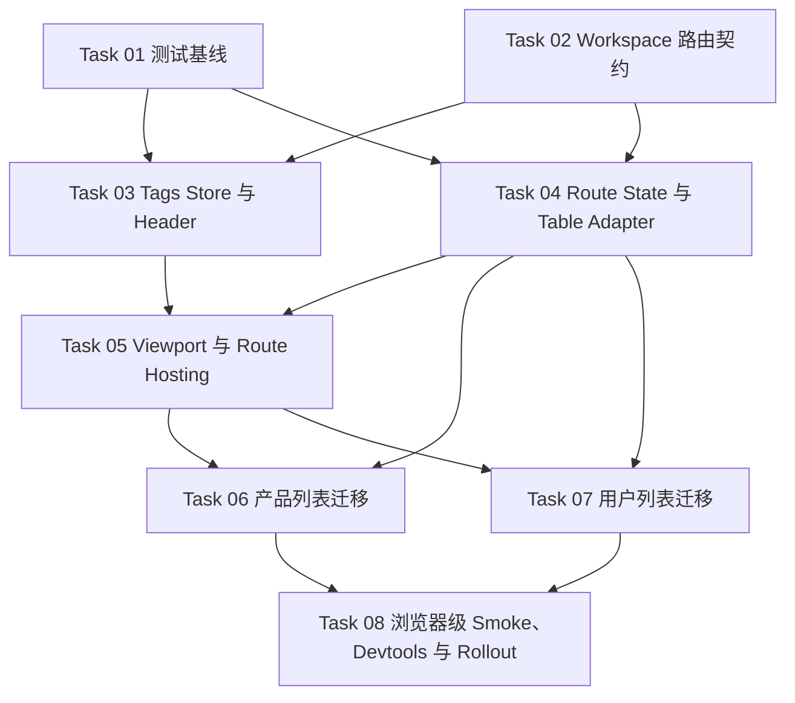

# Workspace Tabs 与 Screen 级 Keep-Alive 实施计划

**Goal:** 为 dashboard 引入 `TagsBar` 与 workspace keep-alive，建立 `workspace` 路由元数据默认契约，完成产品/用户列表页迁移，并把产品页遗留的 `page-cache` 降级为可切换的 rollback-only 旧链路。
**Architecture:** `TagsBar` 覆盖所有 dashboard 页面，标题直接复用 route static data；workspace shell 在 router 之下托管 keep-alive screen，并只对已注册 descriptor 的 route 生效。非迁移页面通过 `workspace.keepAlive = false` 显式回退到现有 `<Outlet />`，产品/用户列表通过 feature-local route definition 接入自定义 state、`query-invalidate` 刷新和 `<Activity>` 保活。
**Tech Stack:** React 19 `<Activity>`、TanStack Router、TanStack Query、TanStack Table、Zustand、Vitest、Testing Library、TypeScript

## File Map

- Create:
  - `vitest.config.ts`
  - `playwright.config.ts`
  - `src/test/setup.ts`
  - `src/test/smoke/vitest-environment.test.ts`
  - `e2e/workspace-tabs-smoke.spec.ts`
  - `src/lib/router/dashboard-home.ts`
  - `src/config/workspace-tabs.ts`
  - `src/features/workspace-tabs/lib/route-workspace.ts`
  - `src/features/workspace-tabs/lib/route-workspace.test.ts`
  - `src/features/workspace-tabs/lib/dashboard-route-inventory.test.ts`
  - `src/features/workspace-tabs/types.ts`
  - `src/features/workspace-tabs/utils/store.ts`
  - `src/features/workspace-tabs/utils/store.test.ts`
  - `src/features/workspace-tabs/hooks/use-workspace-tags.ts`
  - `src/features/workspace-tabs/hooks/use-dashboard-route-tag-sync.ts`
  - `src/features/workspace-tabs/hooks/use-dashboard-route-tag-sync.test.ts`
  - `src/features/workspace-tabs/lib/workspace-route-state.ts`
  - `src/features/workspace-tabs/lib/workspace-route-state.test.ts`
  - `src/features/workspace-tabs/lib/workspace-registry.ts`
  - `src/features/workspace-tabs/lib/workspace-devtools.ts`
  - `src/features/workspace-tabs/components/workspace-slot-error-boundary.tsx`
  - `src/features/workspace-tabs/components/workspace-viewport.tsx`
  - `src/features/workspace-tabs/components/workspace-viewport.test.tsx`
  - `src/features/workspace-tabs/components/workspace-routing.integration.test.tsx`
  - `src/features/workspace-tabs/components/workspace-route-page.tsx`
  - `src/components/layout/tags-bar.tsx`
  - `src/features/products/components/product-workspace-screen.tsx`
  - `src/features/products/workspace/product-workspace-definition.ts`
  - `src/features/products/workspace/product-workspace-definition.test.ts`
  - `src/features/users/components/users-workspace-screen.tsx`
  - `src/features/users/workspace/users-workspace-definition.ts`
  - `src/features/users/workspace/users-workspace-definition.test.ts`
- Modify:
  - `package.json`
  - `bun.lock`
  - `env.example.txt`
  - `src/lib/router/app-route-meta.ts`
  - `src/routes/index.tsx`
  - `src/routes/dashboard.tsx`
  - `src/routes/dashboard/index.tsx`
  - `src/routes/dashboard/overview.tsx`
  - `src/routes/dashboard/chat.tsx`
  - `src/routes/dashboard/notifications.tsx`
  - `src/routes/dashboard/react-query.tsx`
  - `src/routes/dashboard/kanban.tsx`
  - `src/routes/dashboard/forms/index.tsx`
  - `src/routes/dashboard/forms/basic.tsx`
  - `src/routes/dashboard/forms/multi-step.tsx`
  - `src/routes/dashboard/forms/advanced.tsx`
  - `src/routes/dashboard/forms/sheet-form.tsx`
  - `src/routes/dashboard/elements/icons.tsx`
  - `src/routes/dashboard/product/$productId.tsx`
  - `src/routes/dashboard/product/index.tsx`
  - `src/routes/dashboard/users.tsx`
  - `src/components/layout/header.tsx`
  - `src/hooks/use-data-table.ts`
  - `src/features/products/components/product-listing.tsx`
  - `src/features/products/components/product-tables/index.tsx`
  - `src/features/users/components/user-listing.tsx`
  - `src/features/users/components/users-table/index.tsx`
- Reference:
  - `README.md`
  - `src/lib/data-table-page-size.ts`
  - `src/features/products/api/queries.ts`
  - `src/features/users/api/queries.ts`

## Topology

依赖含义：

- `Task 01` 与 `Task 02` 可以并行，分别解决测试基线和 route metadata 契约。
- `Task 03` 与 `Task 04` 在 `Task 01/02` 之后并行：前者处理 tags/store/UI，后者处理 route state 与表格 adapter。
- `Task 05` 依赖 `Task 03/04`，负责把 shell、descriptor registry 和 `WorkspaceRoutePage` 串起来。
- `Task 06` 与 `Task 07` 在 `Task 04/05` 之后并行迁移产品/用户列表。
- `Task 08` 只在两张列表迁移完成后执行，负责浏览器级 smoke、devtools 接入、feature flag rollout 与 `page-cache` 延迟删除策略。

## Task Table

| Task    | Spec                                                                                       | Depends On       | Parallel Group |
| ------- | ------------------------------------------------------------------------------------------ | ---------------- | -------------- |
| Task 01 | [task-01-test-infra-baseline.md](task-01-test-infra-baseline.md)                           | -                | A              |
| Task 02 | [task-02-route-workspace-contract.md](task-02-route-workspace-contract.md)                 | -                | A              |
| Task 03 | [task-03-tags-store-and-header-bar.md](task-03-tags-store-and-header-bar.md)               | Task 01, Task 02 | B              |
| Task 04 | [task-04-route-state-and-table-adapter.md](task-04-route-state-and-table-adapter.md)       | Task 01, Task 02 | B              |
| Task 05 | [task-05-viewport-and-route-hosting.md](task-05-viewport-and-route-hosting.md)             | Task 03, Task 04 | -              |
| Task 06 | [task-06-product-list-workspace-migration.md](task-06-product-list-workspace-migration.md) | Task 04, Task 05 | C              |
| Task 07 | [task-07-users-list-workspace-migration.md](task-07-users-list-workspace-migration.md)     | Task 04, Task 05 | C              |
| Task 08 | [task-08-regression-devtools-and-rollout.md](task-08-regression-devtools-and-rollout.md)   | Task 06, Task 07 | -              |

## Coordinator Assignment

| Scope             | Coordinator       | Tasks      |
| ----------------- | ----------------- | ---------- |
| Global            | 首席执行代理      | Task 01-08 |
| Workspace Shell   | 前端主程 / 子代理 | Task 03-05 |
| Feature Migration | 列表页迁移子代理  | Task 06-07 |
| Release Gate      | 评审代理          | Task 08    |

## Execution Notes

- `spec/` 一旦开始执行视为冻结；若中途推翻架构假设，新增 `*-v2.md`，不要回写本目录中的既有 spec。
- `runtime/state.md` 是唯一的任务状态看板；执行或评审结束后都要先更新它，再继续下游任务。
