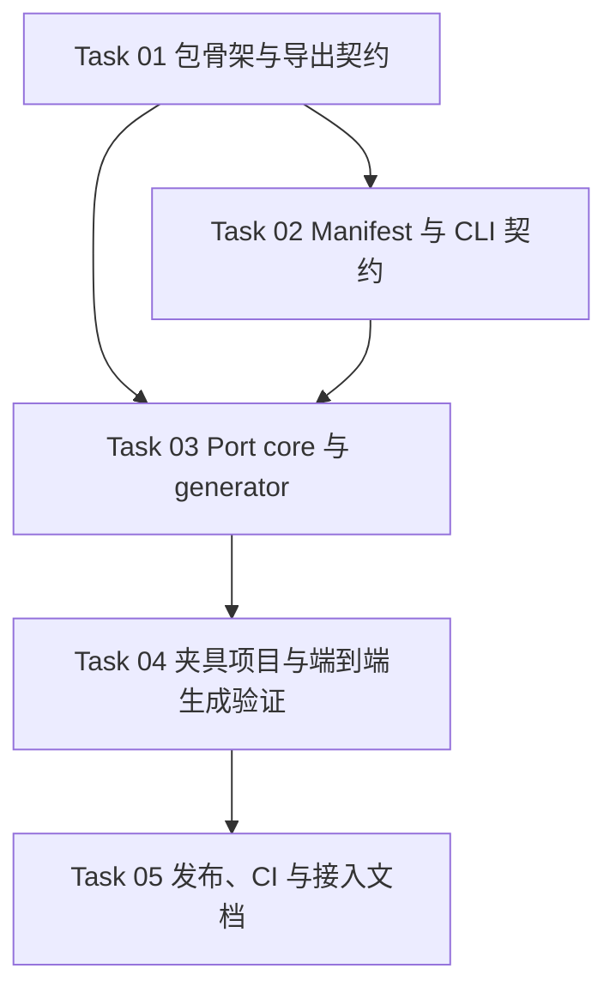

# OpenAPI React Query Client Package Implementation Plan

**Goal:** 把当前仓库内嵌的 OpenAPI React Query codegen 与 runtime core 抽成独立 npm 包 `@oig/react-query-generator`，并提供 `npx openapi-client generate --client xxx` 形式的 CLI 接入。

**Architecture:** 新仓库负责发布三类能力：`@oig/react-query-generator/core` 运行时基座、`@oig/react-query-generator/codegen` 配置与编排 API、`openapi-client` CLI。消费项目只保留 `openapi/specs/**`、`openapi/clients.ts` manifest、`src/lib/api/clients/*/adapters/**` 与稳定根入口；`generated/**` 默认不入库，并由 CLI 在本地或 CI 中重建。

**Tech Stack:** TypeScript、pnpm、Orval、Zod、Vitest、tsup

## Scope Notes

- 本计划中的 `Create / Modify / Test` 路径，默认都相对于**未来独立包仓库根目录**。
- `Reference` 路径指向**当前仓库**的现有实现，用于迁移时对照：
  - `tools/codegen/**`
  - `src/lib/api/core/**`
  - `src/lib/api/clients/**/generated/**`
- 包级统一运行时导入面固定为 `@oig/react-query-generator/core`。generated 代码不得再引用项目内 `@/lib/api/core/*` 或相对路径 `../../../core/*`。

## Topology

依赖含义：

- `Task 01` 先锁定 package exports、build 和 binary 契约。
- `Task 02` 在此基础上定义项目如何通过 `openapi/clients.ts` 被 CLI 加载。
- `Task 03` 才能安全迁移 runtime core 与 generator，因为它依赖前两步的公共 import 与 config 约束。
- `Task 04` 用消费项目夹具验证“安装包后只保留 manifest + specs + adapters”的接入方式。
- `Task 05` 最后补齐发布、CI 和文档，避免边做边漂移。

## Task Table

| Task | Spec | Depends On | Parallel Group |
|------|------|------------|----------------|
| Task 01 | [task-01-package-scaffold-and-exports.md](task-01-package-scaffold-and-exports.md) | - | A |
| Task 02 | [task-02-manifest-and-cli-contract.md](task-02-manifest-and-cli-contract.md) | Task 01 | B |
| Task 03 | [task-03-port-core-and-generator.md](task-03-port-core-and-generator.md) | Task 01, Task 02 | - |
| Task 04 | [task-04-fixture-project-and-e2e.md](task-04-fixture-project-and-e2e.md) | Task 03 | - |
| Task 05 | [task-05-publish-ci-and-adoption-docs.md](task-05-publish-ci-and-adoption-docs.md) | Task 04 | - |

## Shared Runtime Contracts

| Contract | Tasks | Audit Required |
|----------|-------|----------------|
| `core-import-surface` | Task 01, Task 03, Task 04 | yes |
| `manifest-cli-contract` | Task 02, Task 03, Task 04, Task 05 | yes |

## Browser Gates

| Gate | Role | Task |
|------|------|------|
| none | `none` | none |

## Coordinator Assignment

| Scope | Coordinator | Tasks |
|-------|-------------|-------|
| Global | human / lead agent | Task 01-05 |

## Artifact Ownership

| Artifact | Owner |
|----------|-------|
| `runtime/state.md` | coordinator only |
| `runtime/task-NN-log.md` | executor |
| `reviews/task-NN-review.md` | reviewer |
| `reviews/audit-<surface>.md` | auditor |

### Update (2026-06-05)

- 实现状态：
  - `Task 01` 已完成，包骨架、exports、`peerDependencies["@tanstack/react-query"]` 与 `dependencies.orval` contract 已固定。
  - `Task 02` 已完成，`openapi/clients.ts` manifest loader 与 CLI 参数契约已落地。
  - `Task 03` 已完成，runtime core 与 generator 已迁入新包，生成产物统一导向 `@oig/react-query-generator/core`。
  - `Task 04` 已完成，夹具项目已经证明“只保留 manifest + specs + adapters”即可真实安装、生成、typecheck 并通过 `.gitignore` 验证。
  - `Task 05` 已完成，README、迁移文档、CI、changesets 基础配置和 `pnpm pack --dry-run` 验证全部落地。
- 依赖关系：
  - `Task 04` 依赖的 shim contract 已从“纯 re-export”校正为“本地 wrapper 调 package core”，这是基于 Orval 8.15.0 mutator AST 解析限制做出的实现更新，不改变整体 npm 包架构。
  - `Task 05` 需要吸收 Task 04 暴露出的两个交付约束：pnpm 11 首次安装可能需要批准 `esbuild` build script，以及 CLI bin 产物只能保留单一 shebang。
  - 两个共享 contract audit 已完成：`core-import-surface` 与 `manifest-cli-contract` 均通过。

### Update (2026-06-05)

- 实现状态：
  - 当前消费仓库已开始从内嵌 `tools/codegen/** + src/lib/api/core/**` 迁移到 package 形态。
  - `package.json` scripts 已切换为 `npx openapi-client fetch-spec|generate` 契约，并新增 `openapi/clients.ts` 作为消费侧 manifest 入口。
- 依赖关系：
  - 消费仓库后续生成结果将直接依赖 `@oig/react-query-generator/core`，因此 package 需要作为运行时依赖保留，不能只放在 devDependencies。
