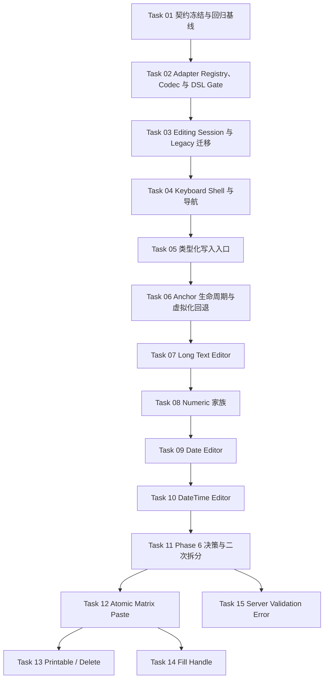

# DataTable 类型化单元格编辑器任务总览

**Parent Design:** [DataTable 类型化单元格编辑器设计](../../2026-07-30-data-table-typed-cell-editors-design.md)

**Status:** COMPLETE — Task 01–15 已完成

**Execution Gate:** 父设计已由首席架构师明确批准并更新为 `APPROVED`，task 按下述拓扑串行执行。

## 目标

把父设计拆成可独立执行、验证和 Review 的任务单元，确保：

- Phase 1 的架构迁移不会与新 editor 同时混做。
- 每种 public editable type 都在 codec、runtime、类型和浏览器验证通过后单独开放。
- 现有 text、choice、switch、跨页草稿、范围选择和虚拟化行为保持向后兼容。
- Phase 6 的未决策略先经过决策门，再生成实现 task。

## 任务拓扑



## Task Table

| Task    | Spec                                                                                   | Phase   | Depends On | 交付类型        |
| ------- | -------------------------------------------------------------------------------------- | ------- | ---------- | --------------- |
| Task 01 | [契约冻结与回归基线](task-01-contract-freeze-and-regression-baseline.md)               | Phase 0 | 架构批准   | test / contract |
| Task 02 | [Adapter Registry、Codec 与 DSL Gate](task-02-adapter-registry-codec-and-dsl-gate.md)  | Phase 1 | Task 01    | architecture    |
| Task 03 | [Editing Session 与 Legacy 迁移](task-03-editing-session-and-legacy-migration.md)      | Phase 1 | Task 02    | runtime         |
| Task 04 | [Keyboard Shell 与导航](task-04-editor-keyboard-shell-and-navigation.md)               | Phase 1 | Task 03    | interaction     |
| Task 05 | [类型化写入入口](task-05-typed-write-entrypoints.md)                                   | Phase 1 | Task 04    | runtime         |
| Task 06 | [Anchor 生命周期与虚拟化回退](task-06-anchor-lifecycle-and-virtualization-fallback.md) | Phase 1 | Task 05    | lifecycle       |
| Task 07 | [Long Text Editor](task-07-long-text-editor.md)                                        | Phase 2 | Task 06    | feature         |
| Task 08 | [Numeric 家族](task-08-numeric-editor-family.md)                                       | Phase 3 | Task 07    | feature         |
| Task 09 | [Date Editor](task-09-date-editor.md)                                                  | Phase 4 | Task 08    | feature         |
| Task 10 | [DateTime Editor](task-10-date-time-editor.md)                                         | Phase 5 | Task 09    | feature         |
| Task 11 | [Phase 6 决策与二次拆分](task-11-phase-6-decision-and-follow-up-breakdown.md)          | Phase 6 | Task 10    | decision        |
| Task 12 | [Atomic Matrix Paste](task-12-atomic-matrix-paste-prepare-apply.md)                    | Phase 6 | Task 11    | feature         |
| Task 13 | [Printable Key 与 Delete / Backspace](task-13-printable-key-delete-backspace.md)       | Phase 6 | Task 12    | interaction     |
| Task 14 | [Fill Handle](task-14-fill-handle.md)                                                  | Phase 6 | Task 12    | feature         |
| Task 15 | [Server Validation Error 回写](task-15-server-validation-error-cell-state.md)          | Phase 6 | Task 11    | runtime         |

同一工作区内按拓扑串行执行。Task 05 与 Task 06、Task 08 与 Task 09 虽存在部分逻辑并行空间，但都会修改 adapter、runtime 或 editor dispatcher，不安排并行写入。

## Phase Exit Gates

### Phase 1

Task 01–06 全部完成后才允许进入新 editor：

- 生产代码中的旧 `activeCell.value` 消费点归零。
- text、choice、switch 的既有交互和跨页草稿契约无回归。
- `finishEditing()` 返回结构化结果，失败提交不会触发导航。
- editor、单 cell paste、raw programmatic write 共用 column-bound codec。
- matrix paste 保持关闭。
- anchor detach fallback、StrictMode 重挂载和 stale session 测试通过。

### V1

Task 07–10 按顺序打开 public capability gate：

- `longText`
- `number` / `int` / `decimal` / `money` / `percent`，逐个开放
- `date`
- `dateTime`

某个 type 未满足自己的退出条件时，不得因同族其他 type 完成而提前公开。

### Phase 6

Task 11 只负责证据收集、决策和二次拆分，不直接把所有增强混入一个实现提交。它不阻塞 V1 发布。

2026-07-31 首席架构师已确认 matrix paste 使用 `atomic`、virtualizer pinning
`no-go`，并批准以带 provenance 的合成 Excel-compatible fixture 替代真实 clipboard
采样。Task 11–15 已完成。

## 全局不变量

- 不新增平行的 editable column API；继续使用 `columnDsl.editableField()`。
- row、snapshot 和 `DataTableCellChange<TData>` 始终保存字段真实领域类型。
- DataTable 不负责业务 mutation 或持久化。
- adapter 和 codec 绑定具体列；不得共享带列配置的可变单例。
- 缺失 adapter、codec 或必需时区时 fail closed，不回退成 text editor。
- 新 public type 必须由 capability gate 控制。
- editor 的原始输入保存在 table-level session；未完成 draft 不进入业务 snapshot。
- popup 复用现有 `Popover`、`Calendar`、`Textarea`、`InputGroup` 和 workspace overlay container。
- 不新增或升级依赖；如 DateTime 的正确性确实需要新依赖，停止对应 task，并单独提交架构与依赖决策。
- 不修改 number / boolean 的服务端 DSL 筛选序列化能力。
- 不格式化或重构任务范围外代码。

## 统一验证要求

每个 task 至少执行其规格内的目标 Vitest、`pnpm typecheck` 和 `pnpm lint`。涉及真实 popup、虚拟化或键盘跨 cell 行为的 task 还必须执行：

```bash
pnpm test:e2e:smoke e2e/data-table-editing-example.smoke.spec.ts --grep @workspace-v2
```

Phase 1 和 V1 出口额外执行：

```bash
pnpm check
pnpm build
pnpm test:e2e:smoke e2e/data-table-editing-example.smoke.spec.ts --grep @workspace-v2
pnpm test:e2e:smoke e2e/data-table-cell-range-selection.smoke.spec.ts --grep @workspace-v2
```

若全仓验证存在与本任务无关的基线失败，必须记录完整命令、失败用例和与本 task 无关的证据，不得通过修改无关代码掩盖。

## Review 与文档回写

每个 task 完成后：

1. 在对应 task 文件末尾追加 `## Review (YYYY-MM-DD)`。
2. 记录实际完成差异、阻塞或技术债务。
3. 后续行动项使用 `TODO` / `FIXME` / `DEPRECATED`，并标注 P0–P2。
4. 在父设计末尾追加 `### Update (YYYY-MM-DD)`，只更新实现状态或依赖关系，不改写原设计。
