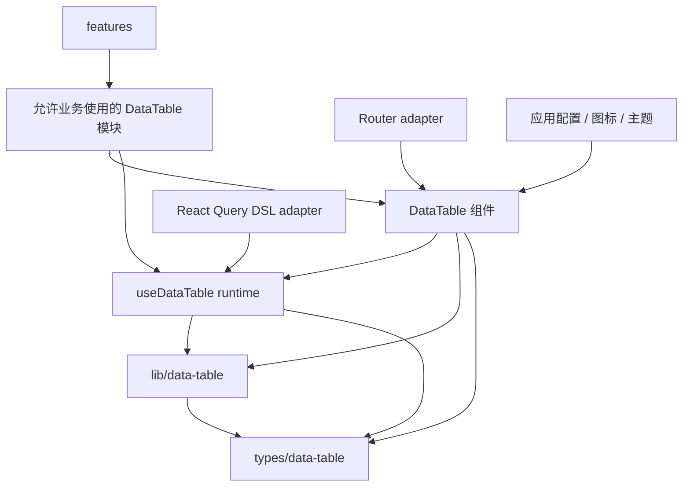
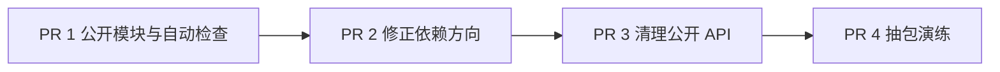

# DataTable 库化治理计划

**Date:** 2026-08-03

**Status:** APPROVED FOR PLANNING — 首席架构师已确认治理方向，实施尚未开始

**Goal:** 不立即迁移到 `packages/` 或发布 npm 包。先用四个独立 PR 限制业务导入、修正依赖方向、减少公开 API，并完成一次抽包演练。

**Report:** [DataTable 库化治理汇报](../data-table-library-governance-report.html)

**Rules:** [DataTable 开发规范](../../.agents/skills/oig-tanstack-admin/references/data-table.md) · [项目结构与组件归属](../../.agents/skills/oig-tanstack-admin/references/project-structure.md)

---

## 1. 当前决定

DataTable 继续作为仓库内部共享子系统维护。

本计划完成前：

- 不迁移到 `packages/`。
- 不创建独立 `package.json`。
- 不发布 npm 包。
- 不增加根级 flat barrel。
- 不增加旧路径 alias、兼容转发或新旧路径双写。
- 不把依赖升级混进治理 PR。
- 不重做 DataTable 的视觉和交互。

治理完成后，再根据独立消费者数量和抽包演练结果决定是否建立正式 package。

## 2. 当前基线

统计范围：

- `src/components/data-table/`
- `src/hooks/use-data-table/`
- `src/lib/data-table/`
- DataTable 相关配置与共享类型

| 项目                     | 当前值                                    |
| ------------------------ | ----------------------------------------- |
| TS / TSX 文件            | 123                                       |
| 生产代码                 | 19,749 行                                 |
| 测试代码                 | 15,718 行                                 |
| 实现与测试合计           | 35,467 行                                 |
| 相关测试                 | 43 个测试文件、501 个测试通过             |
| 真实业务消费者           | IAM、字典管理、导出中心                   |
| 契约 / 演示消费者        | elements、workspace overlay contract page |
| 最近一次集中目录调整时间 | 2026-07-31                                |
| 当前分支                 | `main`                                    |

当前已确认的问题：

1. feature 可以直接导入部分 DataTable 内部组件，没有机器检查的公开模块名单。
2. [共享类型](../../src/types/data-table.ts)反向依赖 [DataTable 配置](../../src/config/data-table.ts)。
3. [useDataTable Props](../../src/hooks/use-data-table/types.ts)依赖组件层的 `DataTableRowAction` 类型。
4. Router、React Query、环境配置、图标和主题仍属于当前应用集成，不能直接视为通用内核。
5. `DataTableLinkButtonCell` 只有导出中心使用；`DataTableRouterLinkCell` 没有生产消费者。
6. `statusDeps`、`enableAdvancedFilter`、`isProductTableVirtualizationEnabled` 已废弃，业务代码没有消费者。

## 3. 目标依赖方向



依赖规则：

- `src/features/` 只能导入允许名单内的 DataTable 模块。
- `src/components/data-table/` 禁止导入 `src/features/`。
- `src/lib/data-table/` 禁止依赖 React、JSX、Shadcn、Router 和 React Query。
- `src/hooks/use-data-table/` 只依赖 React、TanStack Table、共享类型和纯算法；React Query 只允许出现在 `useDslDataTable` 及其 DSL 文件中。
- Router、环境变量、项目主题和图标不能成为纯算法或 hook runtime 的必需依赖。

## 4. PR 顺序



四个 PR 串行执行。PR 1 和 PR 2 都会修改架构契约；PR 2 和 PR 3 都会调整公共类型或导入，不能并行开发。

---

## 5. PR 1：公开模块名单与自动检查

### 5.1 目标

先限制新的错误依赖，不改变 DataTable 运行时、页面行为和视觉。

### 5.2 主要改动

扩展 [项目架构契约测试](../../src/test/contracts/project-architecture.test.ts)，增加 DataTable 专项规则。

#### A. 建立三类导入名单

初始“允许业务使用”名单：

- `@/components/data-table/core/data-table`
- `@/components/data-table/columns/data-table-column-factory`
- `@/components/data-table/columns/data-table-audit-columns`
- `@/components/data-table/toolbar/data-table-toolbar`
- `@/components/data-table/actions/data-table-actions-bar`
- `@/components/data-table/actions/data-table-row-action`
- `@/components/data-table/feedback/data-table-skeleton`
- `@/hooks/use-data-table`
- `@/types/data-table`

“评审后使用”名单：

- `DataTableStatus`
- Export Dialog
- 通用 Cell
- 自定义列类型
- 独立筛选组件

“业务禁止使用”范围：

- `core/data-table-header`
- `core/data-table-body`
- `core/data-table-colgroup`
- `core/data-table-pinning`
- `core/use-data-table-cell-*`
- `dnd/`
- `virtualization/`
- 编辑 codec、adapter 和 editor navigation
- paste、fill、cell range 内部算法
- `expand/use-data-table-expand-panel`

PR 1 实施时必须根据 feature 的真实导入重新生成清单；不得只复制本计划中的候选列表。

#### B. 增加依赖检查

- feature 导入 `src/components/data-table/` 时，路径必须在允许名单或明确例外中。
- `src/components/data-table/` 不得导入 `src/features/`。
- `src/lib/data-table/` 不得导入 `react`、React UI、Router、React Query 或 `src/components/`。
- 禁止新增 DataTable flat barrel、旧路径 alias 和兼容转发。
- 禁止生产 feature 使用已废弃的 `statusDeps`、`enableAdvancedFilter` 和 `isProductTableVirtualizationEnabled`。

#### C. 明确测试例外

以下页面属于契约测试或演示，不作为普通业务消费者：

- `src/features/elements/components/data-table-editable-choice-contract-page.tsx`
- `src/features/workspace-tabs/components/workspace-overlay-contract-page.tsx`

例外必须写出完整文件路径和允许导入的完整模块路径，禁止使用目录级通配放行。

### 5.3 不做

- 不移动组件和类型。
- 不修改 feature 导入路径。
- 不删除废弃 API。
- 不修改 DataTable Props。
- 不新增 package 或构建脚本。

### 5.4 验证

```bash
pnpm vitest run src/test/contracts/project-architecture.test.ts
pnpm lint
pnpm typecheck
```

### 5.5 验收条件

- 现有生产 feature 导入全部被明确分类。
- 架构测试可以拦截一个临时构造的内部模块违规导入。
- 所有例外均为精确文件路径，不存在目录级永久豁免。
- 页面运行时和 DataTable 行为零变化。

---

## 6. PR 2：修正类型和运行时依赖方向

### 6.1 目标

消除 `types -> config` 和 `hooks -> components` 两个反向依赖，不改变页面调用方式和 DataTable 行为。

### 6.2 主要改动

#### A. Action 契约归入共享类型

将以下纯契约归入 [src/types/data-table.ts](../../src/types/data-table.ts)：

- `DataTableActionContext`
- `DataTableActionResolver`
- `DataTableRegularAction`
- `DataTableSelectionAction`
- `DataTableAction`
- `DataTableRowAction`

对应组件改为消费共享类型：

- [DataTableActionsBar](../../src/components/data-table/actions/data-table-actions-bar.tsx)
- [DataTableRowActions](../../src/components/data-table/actions/data-table-row-action.tsx)
- `src/hooks/use-data-table/`

所有 feature 在同一个 PR 中更新类型导入，旧组件路径不保留 type alias 或兼容转发。

#### B. 筛选类型不再从配置反推

- `FilterOperator` 和 `FilterVariant` 的联合类型由共享契约定义。
- [dataTableConfig](../../src/config/data-table.ts) 使用这些契约检查配置值。
- [src/types/data-table.ts](../../src/types/data-table.ts) 删除对 `@/config/data-table` 的导入。
- 配置仍负责默认值和可选项列表，类型文件只负责允许的值。

#### C. 收紧架构检查

- PR 1 若为现有反向依赖设置了临时例外，PR 2 必须删除这些例外。
- `src/hooks/use-data-table/` 禁止继续从 `src/components/data-table/` 导入纯类型。

### 6.3 BREAKING SOURCE IMPORT

本 PR 会调整 `DataTableAction` 和 `DataTableRowAction` 的类型导入路径。

实施要求：

- 在同一个 PR 中更新仓库内全部消费者。
- 不保留旧路径兼容转发。
- 不改变类型字段和运行行为。
- 合并前由首席架构师确认导入路径变化。

### 6.4 不做

- 不修改 Action UI、排序或确认交互。
- 不删除废弃 API。
- 不调整 DataTable Props 结构。
- 不迁移目录。
- 不升级依赖。

### 6.5 验证

```bash
pnpm vitest run src/test/contracts/project-architecture.test.ts
pnpm vitest run src/components/data-table src/hooks/use-data-table src/lib/data-table src/config/data-table.test.ts
pnpm lint
pnpm typecheck
pnpm build
```

### 6.6 验收条件

- `src/types/data-table.ts` 不再导入 DataTable 配置。
- `src/hooks/use-data-table/` 不再从组件层导入 Action 类型。
- Action 类型字段和现有 feature 行为保持不变。
- 相关单测、类型检查和构建通过。

---

## 7. PR 3：删除无效出口，下沉单业务组件

### 7.1 目标

减少业务可见的 API，删除仓库内无人使用的废弃入口，把单业务组件放回对应 feature。

### 7.2 主要改动

#### A. 删除无人使用的废弃入口

当前仓库确认没有生产消费者：

- `DataTableProps.statusDeps`
- `UseDataTableProps.enableAdvancedFilter`
- `isProductTableVirtualizationEnabled`

删除时同步处理：

- 类型声明。
- 开发环境 warning。
- 配置出口。
- 相关测试和有效文档。

禁止保留兼容 alias。

#### B. 处理单业务和零消费者 Cell

- `DataTableLinkButtonCell` 当前只被导出中心使用。若 PR 3 实施时仍只有该消费者，将其移动到 `src/features/export-center/`。
- `DataTableRouterLinkCell` 当前没有生产消费者。若 PR 3 实施时仍无人使用，删除该文件。
- 移动或删除后同步更新测试和有效文档，不保留旧路径转发。

#### C. 评审剩余扩展出口

保留的候选：

- `DataTableSkeleton`：已有多个真实消费者。
- `auditColumns`：已有 IAM、字典、导出中心消费者。
- `DataTableStatus`：由 DataTable 内部和业务空态契约共同使用。

评审标准：

- 至少两个真实 feature 使用。
- 使用语义一致。
- 不包含单一领域权限、接口或导航逻辑。

#### D. 阻止 Props 继续膨胀

- 本 PR 不重做现有 Props。
- 在开发规范和架构 Review 清单中增加规则：新增 `showXxx`、`enableXxx` 前，必须先证明现有配置对象或显式组合无法表达。
- 一次性业务开关留在 feature，不进入 DataTable。

### 7.3 BREAKING PUBLIC SOURCE

本 PR 会删除或移动公开源码入口。虽然仓库内没有对应消费者或只有一个消费者，仍按破坏性变更处理。

合并门：

- 实施前再次执行全仓 `rg` 消费者审计。
- 列出删除和移动清单。
- 由首席架构师确认后再合并。

### 7.4 不做

- 不重构 DataTable 主组件。
- 不引入 compound component 新 API。
- 不把现有所有布尔 Props 一次性改成配置对象。
- 不修改 Router、React Query 或虚拟化行为。
- 不升级依赖。

### 7.5 验证

```bash
pnpm vitest run src/test/contracts/project-architecture.test.ts
pnpm vitest run src/components/data-table src/hooks/use-data-table src/lib/data-table src/config/data-table.test.ts
pnpm lint
pnpm typecheck
pnpm build
```

如果移动 `DataTableLinkButtonCell` 后修改了导出中心页面，还需执行对应页面测试。

### 7.6 验收条件

- 三个废弃入口从生产代码和有效文档中删除。
- 零消费者共享文件不再保留。
- 单业务 Cell 回到对应 feature。
- 没有旧路径 alias、兼容转发或新旧路径双写。
- 页面功能和视觉没有回归。

---

## 8. PR 4：抽包演练与最终决策

### 8.1 目标

不创建正式 package。通过编译 fixture、依赖审计、构建和浏览器回归，确认 DataTable 距离独立包还缺什么。

### 8.2 主要改动

#### A. 建立最小消费者 fixture

fixture 只能使用 PR 1 确定的公开模块，至少覆盖：

- `createDataTableColumnDsl`
- `useDataTable`
- `useDslDataTable`
- `DataTable`
- `DataTableToolbar`
- Action 类型
- Editing 类型

fixture 只用于编译和契约检查，不接入正式路由和导航。

#### B. 审计公开模块的传递依赖

输出至少四份清单：

1. React / TanStack 必需依赖。
2. Shadcn、Dnd、Virtual、日期等 UI 依赖。
3. React Query、Router、file-saver 等可选集成依赖。
4. 当前应用专属依赖：`@/components/icons`、env、主题 CSS、中文消息。

只记录真实传递依赖，不在本 PR 中迁移 package。

#### C. 检查样式边界

- 列出 `src/styles/globals.css` 中 DataTable 必需的基础选择器。
- 列出主题文件中的 DataTable token 和额外选择器。
- 区分“表格运行必需样式”和“当前项目主题覆盖”。
- 不在本 PR 中重写主题系统。

#### D. 补齐浏览器回归入口

[DataTable 开发规范](../../.agents/skills/oig-tanstack-admin/references/data-table.md)要求运行：

```bash
pnpm test:e2e:smoke e2e/data-table-regression.smoke.spec.ts --grep @workspace-v2
```

当前仓库没有 `e2e/data-table-regression.smoke.spec.ts`。PR 4 必须补齐该文件，覆盖：

- 首屏有数据。
- 横向滚动。
- 纵向滚动。
- 固定列仍可见。
- header / body 基础对齐。

#### E. 输出抽包决策

PR 4 Review 必须给出一个明确结果：

- `KEEP_INTERNAL`：继续作为仓库内部库。
- `READY_FOR_PACKAGE_PLAN`：可以另建 package 迁移计划。
- `BLOCKED`：列出阻塞依赖和负责人。

PR 4 不允许直接把代码移动到 `packages/`。

### 8.3 不做

- 不发布 npm 包。
- 不增加 workspace package。
- 不改变业务页面导入。
- 不重构 UI 或主题。
- 不为了通过演练增加兼容 alias。
- 不升级依赖。

### 8.4 验证

```bash
pnpm vitest run src/test/contracts/project-architecture.test.ts
pnpm vitest run src/components/data-table src/hooks/use-data-table src/lib/data-table src/config/data-table.test.ts
pnpm lint
pnpm typecheck
pnpm build
pnpm bundle:check
pnpm test:e2e:smoke e2e/data-table-regression.smoke.spec.ts --grep @workspace-v2
pnpm test:e2e:smoke e2e/data-table-editing-example.smoke.spec.ts --grep @workspace-v2
pnpm test:e2e:smoke e2e/data-table-cell-range-selection.smoke.spec.ts --grep @workspace-v2
```

### 8.5 验收条件

- 最小消费者 fixture 只使用公开模块并通过类型检查。
- 公开模块的传递依赖有完整清单。
- DataTable 基础样式和项目主题覆盖已分开记录。
- 缺失的 DataTable 浏览器回归文件已补齐并通过。
- `pnpm bundle:check` 不超出现有预算。
- Review 给出 `KEEP_INTERNAL`、`READY_FOR_PACKAGE_PLAN` 或 `BLOCKED`。

---

## 9. 破坏性变更确认表

| PR   | 变更                                       | 当前状态     |
| ---- | ------------------------------------------ | ------------ |
| PR 2 | Action 类型导入迁移到 `@/types/data-table` | 待实施前确认 |
| PR 3 | 删除 `statusDeps`                          | 待实施前确认 |
| PR 3 | 删除 `enableAdvancedFilter`                | 待实施前确认 |
| PR 3 | 删除 `isProductTableVirtualizationEnabled` | 待实施前确认 |
| PR 3 | 移动 `DataTableLinkButtonCell`             | 待实施前确认 |
| PR 3 | 删除无消费者的 `DataTableRouterLinkCell`   | 待实施前确认 |

在确认前，PR 2 和 PR 3 可以完成只读审计与草案，但不得合并上述破坏性变更。

## 10. 实现状态

| PR   | 状态        | 依赖 | 说明                          |
| ---- | ----------- | ---- | ----------------------------- |
| PR 1 | NOT STARTED | 无   | 可先实施                      |
| PR 2 | NOT STARTED | PR 1 | 破坏性导入变化需确认          |
| PR 3 | NOT STARTED | PR 2 | 删除 / 移动公开源码入口需确认 |
| PR 4 | NOT STARTED | PR 3 | 只做演练，不创建正式 package  |

## 11. Review 与计划更新

每个 PR 完成后，在本文件末尾追加：

```md
### Update (YYYY-MM-DD) — PR N

- 实现状态：
- 依赖关系变化：
- 与原计划的差异：
- 阻塞或技术债务：
- TODO / FIXME / DEPRECATED（P0-P2）：
```

只追加实现状态和依赖关系，不改写本计划中的原始设计描述。
