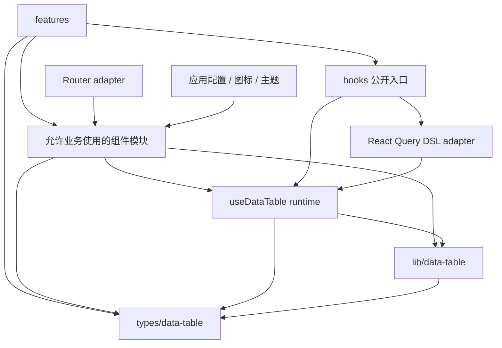

# DataTable 库化治理计划

**Date:** 2026-08-03

**Status:** APPROVED FOR PLANNING — 首席架构师已确认公开面收缩方向，实施尚未开始

**Goal:** 不立即迁移到 `packages/` 或发布 npm 包。先用四个串行 PR 建立机器边界、修正依赖方向、收紧业务公开 API，并完成一次抽包演练。

**Rules:** [DataTable 开发规范](../../.agents/skills/oig-tanstack-admin/references/data-table.md) · [项目结构与组件归属](../../.agents/skills/oig-tanstack-admin/references/project-structure.md)

---

## 1. 已确认的治理决定

DataTable 继续作为仓库内部共享子系统维护。本计划治理的是业务可见边界和依赖方向，不是立即抽成独立 package。

### 1.1 最终业务公开模块

普通 `src/features/` 生产代码只允许直接导入以下模块：

| 模块路径                                                    | 业务用途                                                  |
| ----------------------------------------------------------- | --------------------------------------------------------- |
| `@/components/data-table/core/data-table`                   | 渲染共享 `DataTable`                                      |
| `@/components/data-table/columns/data-table-column-factory` | 创建列 DSL；审计列通过 DSL 内置宏声明                     |
| `@/components/data-table/toolbar/data-table-toolbar`        | 组合标准筛选工具栏                                        |
| `@/hooks/use-data-table`                                    | 使用 `useDataTable` 或 `useDslDataTable` 及必要的公开类型 |
| `@/types/data-table`                                        | 使用 Action、Editing 等跨层公共类型                       |

除精确例外外，其他 `src/components/data-table/` 深层模块对业务默认关闭。

### 1.2 Hook 公开契约

`@/hooks/use-data-table` 的最终运行时出口只保留两个 hook：

- `useDataTable`：基础表格状态层，仅用于本地数组、非分页接口、多接口拼装、树形表格或其他非标准场景。
- `useDslDataTable`：标准 DSL 服务端分页表格入口，在 `useDataTable` 之上负责 request 构建、React Query 生命周期、页长偏好、响应映射和刷新状态。

两个 hook 保持显式分层，不合并为带 `mode` 的万能 hook，也不互相改名。

以下运行时符号不再从 `@/hooks/use-data-table` 对业务公开：

- `DATA_TABLE_DSL_SUPPORTED_FILTER_VARIANTS`
- `buildDataTableDslRequest`
- `isDataTableDslFilterVariantSupported`
- `isDataTableDslOperatorCompatibleWithVariant`
- `makeApiFilters`

其中 DSL 构建与校验函数继续作为 `useDslDataTable` 内部实现和同层测试目标；`makeApiFilters` 在实施时若仍无消费者则删除。

类型出口不以“当前是否显式 import”作为唯一判断标准。PR 3 必须同时检查公共 hook 签名、fixture 和真实业务消费者，保留组成公共契约所必需的类型，删除纯内部类型出口。

### 1.3 列、Action 与渲染组件边界

- `auditColumns` 不再作为业务独立入口。新增 `columnDsl.audit()` 列宏，内部固定生成 `createInfo`、`updateInfo` 两列；业务通过列 DSL 使用，不直接导入审计 helper。
- `columnDsl.audit()` 是“一次展开多列”的列宏，不属于一字段一列的普通 `type` registry。不得通过运行时扫描首行数据自动判断审计字段。
- `DataTableActionsBar`、`DataTableRowActions` 只负责渲染，保持 DataTable 内部实现；业务只声明 Action 语义、权限和回调。
- Action 纯类型契约统一从 `@/types/data-table` 提供，组件文件不保留类型兼容转发。
- `DataTableSkeleton` 保持 DataTable 内部实现。业务统一通过 `DataTable` 的 `isLoading` 与 `loadingSkeleton` props 触发，不直接导入 Skeleton。
- `DataTable` 与 `DataTableToolbar` 继续作为公开组件，不由 hook 返回。
- hook 只返回状态、控制器和稳定 prop bundle，禁止返回 JSX、React 组件类型或页面布局。

### 1.4 本计划明确不做

- 不迁移到 `packages/`。
- 不创建独立 `package.json` 或 workspace package。
- 不发布 npm 包。
- 不增加根级 flat barrel。
- 不增加旧路径 alias、兼容转发或新旧路径双写。
- 不把 `useDataTable` 与 `useDslDataTable` 合并为单个多模式 hook。
- 不新增 `DslDataTable` 高层门面组件或 compound component API。
- 不让 hook 返回 `DataTable`、`DataTableToolbar`、`DataTableSkeleton` 或 `DataTableActionsBar`。
- 不重做 DataTable 视觉、交互、Router、React Query 或主题系统。
- 不把依赖升级混入治理 PR。

治理完成后，再根据独立消费者数量和抽包演练结果决定是否建立正式 package 或单独设计更高层业务门面。

## 2. 当前基线

统计范围：

- `src/components/data-table/`
- `src/hooks/use-data-table/`
- `src/lib/data-table/`
- DataTable 相关配置与共享类型

| 项目                     | 当前值                                    |
| ------------------------ | ----------------------------------------- |
| TS / TSX 文件            | 123                                       |
| 生产代码                 | 19,749 行                                 |
| 测试代码                 | 15,718 行                                 |
| 实现与测试合计           | 35,467 行                                 |
| 相关测试                 | 43 个测试文件、501 个测试通过             |
| 真实业务消费者           | IAM、字典管理、导出中心                   |
| 契约 / 演示消费者        | elements、workspace overlay contract page |
| 最近一次集中目录调整时间 | 2026-07-31                                |
| 当前分支                 | `main`                                    |

当前消费者审计结果：

- `useDslDataTable`：6 个生产表格实例，另有 1 个契约演示实例。
- `useDataTable`：3 个生产场景，分别是本地按钮权限列表、非标准字典类型组合、树形部门表格。
- `auditColumns`：5 个生产消费者。
- `DataTableSkeleton`：4 个生产文件、5 个表格加载态直接使用。
- `DataTableActionsBar`：无生产业务渲染消费者；业务仅从该文件导入 Action 类型。
- `DataTableRowActions`：无生产业务渲染消费者；业务仅从该文件导入 `DataTableRowAction` 类型。
- `buildDataTableDslRequest`、`makeApiFilters`：无生产业务消费者。

当前已确认的问题：

1. feature 可以直接导入 DataTable 内部组件，没有机器检查的公开模块名单和精确例外表。
2. `@/hooks/use-data-table` 同时公开内部 DSL 算法、兼容校验和无消费者 helper，运行时出口大于业务所需。
3. `auditColumns`、`DataTableSkeleton` 和 Action 类型要求业务知道内部文件路径，扩大了业务导入面。
4. [共享类型](../../src/types/data-table.ts)反向依赖 [DataTable 配置](../../src/config/data-table.ts)。
5. [useDataTable Props](../../src/hooks/use-data-table/types.ts)依赖组件层的 `DataTableRowAction` 类型。
6. Router、React Query、环境配置、图标和主题仍属于当前应用集成，不能直接视为通用内核。
7. `DataTableLinkButtonCell` 只有导出中心使用；`DataTableRouterLinkCell` 没有生产消费者。
8. `statusDeps`、`enableAdvancedFilter`、`isProductTableVirtualizationEnabled` 已废弃，业务代码没有消费者。

PR 实施前必须重新执行全仓消费者审计；本节数字只作为 2026-08-03 计划基线，不替代实施时结果。

## 3. 目标依赖方向



依赖规则：

- `src/features/` 只能导入最终业务公开模块或精确到“完整文件路径 + 完整模块路径”的例外。
- `src/components/data-table/` 禁止导入 `src/features/`。
- `src/lib/data-table/` 禁止依赖 React、JSX、Shadcn、Router、React Query 或 `src/components/`。
- 基础 `useDataTable` runtime 只依赖 React、TanStack Table、共享类型和纯算法。
- React Query 只允许出现在 `useDslDataTable` 及其 DSL adapter 文件中。
- `src/hooks/use-data-table/` 禁止依赖 DataTable React 组件；组件层可以向下消费 hook。
- Router、环境变量、项目主题和图标不能成为纯算法或 hook runtime 的必需依赖。
- Action、Editing、筛选等跨层纯契约进入 `src/types/data-table.ts`，渲染器保留在组件层。
- 业务公开模块采用默认拒绝；新增路径必须先通过复用性、依赖方向和测试评审。

## 4. PR 顺序


四个 PR 串行执行：

- PR 1 先冻结边界并登记现有临时例外，阻止新增错误依赖。
- PR 2 迁移公共类型并删除 `hooks -> components`、`types -> config` 反向依赖。
- PR 3 使用稳定契约完成业务导入迁移，并删除无消费者出口。
- PR 4 只能消费 PR 3 确定的最终公开面。

---

## 5. PR 1：公开边界与自动检查

### 5.1 目标

先建立默认拒绝的机器边界，不改变 DataTable 运行时、页面行为和视觉。

### 5.2 主要改动

扩展 [项目架构契约测试](../../src/test/contracts/project-architecture.test.ts)，增加 DataTable 专项规则。

#### A. 固化最终业务公开模块

架构测试只允许普通 feature 导入第 1.1 节列出的五个模块路径。

PR 1 实施时必须重新扫描 `src/features/` 和 `src/routes/` 的静态 import、动态 import、`vi.mock()` 及可静态识别的模块字符串，不得只复制本计划中的基线。

#### B. 建立精确临时例外

PR 1 不迁移业务代码，因此以下现有导入按“完整消费者文件 + 完整模块路径”登记临时例外：

- `auditColumns` 的现有生产消费者，等待 PR 3 迁移到 `columnDsl.audit()`。
- `DataTableSkeleton` 的现有生产消费者，等待 PR 3 迁移到 `DataTable` 的 `loadingSkeleton` prop。
- Action 类型的现有组件路径导入，等待 PR 2 迁移到 `@/types/data-table`。
- 导出中心对 `DataTableLinkButtonCell` 的单业务导入，等待 PR 3 下沉。
- workspace overlay 契约页及其集成测试对独立筛选组件的导入。
- 测试文件对内部 `DataTableViewOptions` 等实现的精确 mock；实施时优先消除不必要 mock，无法消除时只允许测试文件级例外。

例外禁止使用目录通配；每个例外必须标注删除 PR，PR 3 合并后不得残留无期限豁免。

#### C. 限制 hooks 公开符号的业务使用

对 `@/hooks/use-data-table` 增加 symbol-level 业务导入检查：

- 运行时只允许业务导入 `useDataTable`、`useDslDataTable`。
- 禁止业务导入 DSL 构建、兼容校验和 `makeApiFilters`。
- type-only import 按真实消费者和公共签名维护单独名单，不与运行时符号混用。

PR 1 只阻止业务新增使用；内部运行时出口在 PR 3 删除。

#### D. 增加依赖检查

- `src/components/data-table/` 不得导入 `src/features/`。
- `src/lib/data-table/` 不得导入 React、React UI、Router、React Query 或 `src/components/`。
- `src/hooks/use-data-table/` 不得导入 DataTable React 组件；PR 2 前只允许已登记的纯类型临时例外。
- 禁止新增 DataTable flat barrel、旧路径 alias、兼容转发和新旧路径双写。
- 禁止生产 feature 使用 `statusDeps`、`enableAdvancedFilter`、`isProductTableVirtualizationEnabled`。

### 5.3 不做

- 不移动组件和类型。
- 不修改 feature 导入路径。
- 不删除公开出口或废弃 API。
- 不修改 DataTable Props、视觉或交互。
- 不新增 package 或构建脚本。

### 5.4 验证

```bash
pnpm vitest run src/test/contracts/project-architecture.test.ts
pnpm lint
pnpm typecheck
```

### 5.5 验收条件

- 现有生产、契约和测试导入全部被明确分类。
- 架构测试可以拦截内部组件路径违规导入。
- 架构测试可以拦截业务从 `@/hooks/use-data-table` 导入 `buildDataTableDslRequest` 或 `makeApiFilters`。
- 所有例外均为精确文件路径和模块路径，并标注删除 PR。
- 页面运行时和 DataTable 行为零变化。

---

## 6. PR 2：修正类型和运行时依赖方向

### 6.1 目标

消除 `types -> config` 和 `hooks -> components` 两个反向依赖，不改变页面调用方式和 DataTable 行为。

### 6.2 主要改动

#### A. Action 契约归入共享类型

将以下纯契约归入 [src/types/data-table.ts](../../src/types/data-table.ts)：

- `DataTableActionContext`
- `DataTableActionResolver`
- `DataTableRegularAction`
- `DataTableSelectionAction`
- `DataTableAction`
- `DataTableRowAction`

对应渲染器改为消费共享类型：

- [DataTableActionsBar](../../src/components/data-table/actions/data-table-actions-bar.tsx)
- [DataTableRowActions](../../src/components/data-table/actions/data-table-row-action.tsx)
- `src/hooks/use-data-table/`

所有 feature 在同一个 PR 中更新 type import；组件路径不保留 type alias 或兼容转发。

迁移后删除 PR 1 中所有 Action 类型临时例外。业务不得直接导入 Action 渲染组件。

#### B. 筛选类型不再从配置反推

- `FilterOperator` 和 `FilterVariant` 联合类型由共享契约定义。
- [dataTableConfig](../../src/config/data-table.ts) 使用共享契约检查配置值。
- [src/types/data-table.ts](../../src/types/data-table.ts) 删除对 `@/config/data-table` 的导入。
- 配置只负责默认值和可选项列表，类型文件只负责允许值。

#### C. 收紧架构检查

- 删除 PR 1 为 `hooks -> components` 设置的全部纯类型例外。
- `src/hooks/use-data-table/` 禁止从 `src/components/data-table/` 导入任何 Action 类型。
- `src/types/data-table.ts` 禁止导入 `src/config/` 和 React 组件。

### 6.3 BREAKING SOURCE IMPORT

本 PR 会将 `DataTableAction`、`DataTableActionContext`、`DataTableRowAction` 等类型导入迁移到 `@/types/data-table`。

实施要求：

- 在同一个 PR 中更新仓库内全部消费者。
- 不保留旧路径兼容转发。
- 不改变类型字段、Action 排序或运行行为。
- 合并前由首席架构师确认导入路径变化。

### 6.4 不做

- 不修改 Action UI、确认交互或权限语义。
- 不删除 hooks 公开运行时 helper；留到 PR 3。
- 不调整 DataTable Props 结构。
- 不迁移目录或升级依赖。

### 6.5 验证

```bash
pnpm vitest run src/test/contracts/project-architecture.test.ts
pnpm vitest run src/components/data-table src/hooks/use-data-table src/lib/data-table src/config/data-table.test.ts
pnpm lint
pnpm typecheck
pnpm build
```

### 6.6 验收条件

- `src/types/data-table.ts` 不再导入 DataTable 配置。
- `src/hooks/use-data-table/` 不再从组件层导入 Action 类型。
- 生产 feature 不再导入 Action 渲染组件路径。
- Action 类型字段和现有 feature 行为保持不变。
- 相关单测、类型检查和构建通过。

---

## 7. PR 3：收紧业务公开 API

### 7.1 目标

把业务公开面收敛到五个模块路径，移除无消费者运行时出口，内化审计列、加载骨架和 Action 渲染器，并处理单业务或零消费者组件。

### 7.2 主要改动

#### A. 收紧 hooks 公开入口

[src/hooks/use-data-table/index.ts](../../src/hooks/use-data-table/index.ts) 的运行时出口最终只允许：

```ts
export { useDataTable } from './use-data-table';
export { useDslDataTable } from './use-dsl-data-table';
```

实施内容：

- 从公开入口移除 `DATA_TABLE_DSL_SUPPORTED_FILTER_VARIANTS`。
- 从公开入口移除 `buildDataTableDslRequest`。
- 从公开入口移除 `isDataTableDslFilterVariantSupported`。
- 从公开入口移除 `isDataTableDslOperatorCompatibleWithVariant`。
- 从公开入口移除 `makeApiFilters`。
- DSL 构建与校验函数继续由同层实现和测试直接导入，不创建新公开路径。
- `makeApiFilters` 若再次全仓审计后仍无消费者，删除实现、注释示例和对应公开入口测试。
- 更新 `src/hooks/use-data-table/index.test.ts`，精确断言公开运行时出口只有两个 hook。
- 审计 type exports；只保留公共 hook 签名、公共列 DSL、业务消费者和 PR 4 fixture 必需的类型。

禁止通过另一个 barrel、alias 或深层白名单重新公开上述内部 helper。

#### B. 将审计列收进列 DSL

- 新增 `columnDsl.audit()` 列宏，返回创建信息、更新信息两列。
- 列 ID、标题、人员/时间布局、空值展示和 `text-xs` 样式保持现状。
- 类型约束继续要求 `createBy`、`createTime`、`updateBy`、`updateTime` 字段兼容现有 `AuditFields`。
- 迁移 5 个生产消费者到 `...columnDsl.audit()`。
- `data-table-audit-columns` 不再作为业务公开模块；实现可以下沉为 DSL 内部 helper 或折叠进列实现层。
- 删除旧业务入口，不保留 `auditColumns` alias 或转发。
- 更新 DataTable 开发规范和相关测试，使审计字段规则指向 `columnDsl.audit()`。

#### C. 内化加载骨架

- 将直接渲染 `DataTableSkeleton` 的生产页面迁移为 `DataTable` 的 `isLoading` + `loadingSkeleton` 配置。
- 优先使用 DataTable 已有列数、筛选数和 view options 自动推导；只有视觉基线确实需要时才保留显式数量。
- 保持首次加载、后台刷新、空态和错误态语义不变。
- `DataTableSkeleton` 继续作为 DataTable 内部组件和同层测试目标，不再进入业务白名单。

#### D. 保持 Action 渲染器内部化

- `DataTableActionsBar` 继续由 `DataTable` 根据 `tableActions` 内部渲染。
- `DataTableRowActions` 继续由 `useDataTable.rowActions` 自动注入操作列。
- 业务只从 `@/types/data-table` 消费 Action 类型，不直接导入两个渲染器。
- 删除 PR 1 中 Action 组件路径临时例外。

#### E. 删除废弃入口

实施前再次确认无生产消费者，然后删除：

- `DataTableProps.statusDeps`
- `UseDataTableProps.enableAdvancedFilter`
- `isProductTableVirtualizationEnabled`

同步删除类型声明、开发环境 warning、配置出口、测试和有效文档，禁止保留兼容 alias。

#### F. 处理单业务和零消费者 Cell

- `DataTableLinkButtonCell` 若仍只有导出中心使用，移动到 `src/features/export-center/`。
- `DataTableRouterLinkCell` 若仍无生产消费者，删除文件。
- 移动或删除后同步更新测试和有效文档，不保留旧路径转发。

#### G. 处理评审后使用能力

以下能力不进入普通业务白名单：

- `DataTableStatus`
- Export Dialog
- `cells/` 下通用 Cell
- 自定义列类型实现模块
- `filters/` 下独立筛选组件

确有业务需要时，只能登记“完整消费者文件 + 完整模块路径”例外，并满足：至少两个真实 feature 使用、语义一致、无单一领域权限/API/导航逻辑。契约演示页面可以保留精确测试例外，但不得扩大成生产目录级放行。

### 7.3 BREAKING PUBLIC SOURCE

本 PR 会删除或移动公开源码入口。即使仓库内无消费者，仍按破坏性 source import 处理。

合并门：

- 再次执行全仓 `rg` 消费者审计。
- 输出“删除、移动、内化、保留类型”四份清单。
- 确认没有仓库外消费者或记录已知迁移责任人。
- 由首席架构师确认后再合并。

### 7.4 不做

- 不合并或重命名 `useDataTable`、`useDslDataTable`。
- 不让 hook 返回组件或 JSX。
- 不新增高层 facade 或 compound component API。
- 不重构 DataTable 主组件的视觉和交互。
- 不把现有所有布尔 Props 一次性改成配置对象。
- 不修改 Router、React Query、虚拟化或主题行为。
- 不升级依赖。

### 7.5 验证

```bash
pnpm vitest run src/test/contracts/project-architecture.test.ts
pnpm vitest run src/hooks/use-data-table/index.test.ts src/hooks/use-data-table/dsl.test.ts
pnpm vitest run src/components/data-table src/hooks/use-data-table src/lib/data-table src/config/data-table.test.ts
pnpm lint
pnpm typecheck
pnpm build
```

修改对应 feature 后，补跑其页面级测试；Skeleton 迁移和审计列迁移至少覆盖一个真实业务页面回归。

补充 `useDslDataTable` 公开 prop bundle 的引用稳定性单测：查询稳定后强制父组件 rerender，验证语义依赖未变化时 `refreshProps`、`refreshProps.onRefresh` 和 `queryState` 引用保持稳定；查询公开状态变化时允许 `queryState` 更新引用。

### 7.6 验收条件

- 普通业务只导入第 1.1 节的五个模块路径。
- `@/hooks/use-data-table` 运行时只公开 `useDataTable`、`useDslDataTable`。
- 业务不再直接导入 `auditColumns`、`DataTableSkeleton`、`DataTableActionsBar` 或 `DataTableRowActions`。
- 审计列统一通过 `columnDsl.audit()` 声明。
- 三个废弃入口从生产代码和有效文档中删除。
- 零消费者共享文件不再保留，单业务 Cell 回到对应 feature。
- PR 1 的临时生产例外全部删除；只保留已批准的契约/测试精确例外。
- `useDslDataTable` 暴露的 prop bundle 引用稳定：语义依赖未变化的父组件 rerender 中，`refreshProps` 及其 `onRefresh` 引用保持稳定；`queryState` 在公开字段未变化时保持稳定，查询状态变化时允许更新引用。
- 页面功能和视觉没有回归。

---

## 8. PR 4：抽包演练与最终决策

### 8.1 目标

不创建正式 package。通过编译 fixture、依赖审计、构建和浏览器回归，验证 PR 3 最终公开面是否足以支持真实消费者，并确认距离独立包还缺什么。

### 8.2 主要改动

#### A. 建立最小消费者 fixture

fixture 只能使用以下公开模块：

- `@/components/data-table/core/data-table`
- `@/components/data-table/columns/data-table-column-factory`
- `@/components/data-table/toolbar/data-table-toolbar`
- `@/hooks/use-data-table`
- `@/types/data-table`

fixture 至少覆盖：

- `createDataTableColumnDsl`、`columnDsl.audit()`。
- `useDataTable` 的本地/树形非 DSL 场景。
- `useDslDataTable` 的标准 `{ list, total }` 服务端分页场景。
- `DataTable`、`DataTableToolbar`。
- Action 类型、Editing 类型。
- DataTable 内部 loading skeleton，不直接导入 `DataTableSkeleton`。

fixture 必须增加负向契约：无法从公开入口导入 `buildDataTableDslRequest`、`makeApiFilters`、Action 渲染器、`auditColumns` 或 `DataTableSkeleton`。

fixture 只用于编译和契约检查，不接入正式路由和导航。

#### B. 审计公开模块的传递依赖

输出至少四份清单：

1. React / TanStack 必需依赖。
2. Shadcn、Dnd、Virtual、日期等 UI 依赖。
3. React Query、Router、file-saver 等可选集成依赖。
4. 当前应用专属依赖：`@/components/icons`、env、主题 CSS、中文消息。

特别确认：

- 基础 `useDataTable` 不传递依赖 React Query 或 React 组件。
- `useDslDataTable` 的 React Query 依赖不反向进入纯算法与基础 hook。
- `DataTable` 负责 ActionBar、Skeleton 和内部 UI 组合，hook 不传递 UI 组件。

只记录真实传递依赖，不在本 PR 中迁移 package。

#### C. 检查样式边界

- 列出 `src/styles/globals.css` 中 DataTable 必需的基础选择器。
- 列出主题文件中的 DataTable token 和额外选择器。
- 区分“表格运行必需样式”和“当前项目主题覆盖”。
- 不在本 PR 中重写主题系统。

#### D. 补齐浏览器回归入口

[DataTable 开发规范](../../.agents/skills/oig-tanstack-admin/references/data-table.md)要求运行：

```bash
pnpm test:e2e:smoke e2e/data-table-regression.smoke.spec.ts --grep @workspace-v2
```

当前仓库没有 `e2e/data-table-regression.smoke.spec.ts`。PR 4 必须补齐该文件，覆盖：

- 首屏有数据和首次加载 Skeleton。
- 横向滚动。
- 纵向滚动。
- 固定列仍可见。
- header / body 基础对齐。
- 标准 Toolbar、顶层 Action 和行 Action 可见。

#### E. 输出抽包决策

PR 4 Review 必须给出一个明确结果：

- `KEEP_INTERNAL`：继续作为仓库内部库。
- `READY_FOR_PACKAGE_PLAN`：可以另建 package 迁移计划。
- `BLOCKED`：列出阻塞依赖、负责人和解除条件。

PR 4 不允许直接把代码移动到 `packages/`。

#### F. 公开 API 形状审计

审计 `UseDataTableProps`、`UseDslDataTableProps`、`DataTableProps`、`ColumnMeta`、`TableMeta` 的职责分组与布尔项数量。`ColumnMeta` / `TableMeta` 即使主要经列 DSL 消费，仍属于公开模块的传递契约，必须纳入审计。

每类 API 必须输出“保持扁平”“分组重构”或“转内部契约”的明确结论。PR 4 只记录审计结论，并登记 `TODO P1` 后续专项计划；形状重构不得混入本计划的四个治理 PR。

#### G. DSL 命名与协议定位

评估 DSL 是否属于准备长期公开的协议概念：若是，保留 `useDslDataTable`；若目标转为通用服务端适配器，则必须在仓库外消费者出现前，通过后续专项一次性完成改名和契约扩展。

本决策不预设 `useServerDataTable` 优于现名，且无论最终采用何种名称，都不得保留双名称 alias。

### 8.3 不做

- 不发布 npm 包。
- 不增加 workspace package。
- 不改变业务页面导入。
- 不重构 UI 或主题。
- 不新增 facade、hook 模式或兼容 alias。
- 不升级依赖。

### 8.4 验证

```bash
pnpm vitest run src/test/contracts/project-architecture.test.ts
pnpm vitest run src/components/data-table src/hooks/use-data-table src/lib/data-table src/config/data-table.test.ts
pnpm lint
pnpm typecheck
pnpm build
pnpm bundle:check
pnpm test:e2e:smoke e2e/data-table-regression.smoke.spec.ts --grep @workspace-v2
pnpm test:e2e:smoke e2e/data-table-editing-example.smoke.spec.ts --grep @workspace-v2
pnpm test:e2e:smoke e2e/data-table-cell-range-selection.smoke.spec.ts --grep @workspace-v2
```

### 8.5 验收条件

- 最小消费者 fixture 只使用五个公开模块并通过类型检查。
- hooks 公开入口的负向导入契约通过。
- 公开模块传递依赖有完整清单。
- DataTable 基础样式和项目主题覆盖已分开记录。
- 缺失的 DataTable 浏览器回归文件已补齐并通过。
- `pnpm bundle:check` 不超出现有预算。
- Review 给出 `KEEP_INTERNAL`、`READY_FOR_PACKAGE_PLAN` 或 `BLOCKED`。

---

## 9. 破坏性变更确认表

| PR   | 变更                                       | 当前状态                         |
| ---- | ------------------------------------------ | -------------------------------- |
| PR 2 | Action 类型导入迁移到 `@/types/data-table` | 待实施前确认                     |
| PR 3 | hooks 运行时出口只保留两个 hook            | 治理方向已确认；合并前复核消费者 |
| PR 3 | `auditColumns` 迁移为 `columnDsl.audit()`  | 治理方向已确认；合并前复核消费者 |
| PR 3 | `DataTableSkeleton` 退出业务公开面         | 治理方向已确认；合并前做视觉回归 |
| PR 3 | 删除 `statusDeps`                          | 待实施前确认                     |
| PR 3 | 删除 `enableAdvancedFilter`                | 待实施前确认                     |
| PR 3 | 删除 `isProductTableVirtualizationEnabled` | 待实施前确认                     |
| PR 3 | 移动 `DataTableLinkButtonCell`             | 待实施前确认                     |
| PR 3 | 删除无消费者的 `DataTableRouterLinkCell`   | 待实施前确认                     |

确认前可以完成只读审计、契约测试和迁移草案；不得合并仍标记“待实施前确认”的破坏性变更。

## 10. 实现状态

| PR   | 状态        | 依赖 | 说明                                     |
| ---- | ----------- | ---- | ---------------------------------------- |
| PR 1 | NOT STARTED | 无   | 先冻结五个公开模块和两个 hook 运行时符号 |
| PR 2 | NOT STARTED | PR 1 | Action 类型导入变化需确认                |
| PR 3 | NOT STARTED | PR 2 | 完成业务迁移并删除公开源码入口           |
| PR 4 | NOT STARTED | PR 3 | 只做演练，不创建正式 package             |

## 11. Review 与计划更新

每个 PR 完成后，在本文件末尾追加：

```md
### Update (YYYY-MM-DD) — PR N

- 实现状态：
- 依赖关系变化：
- 与原计划的差异：
- 阻塞或技术债务：
- TODO / FIXME / DEPRECATED（P0-P2）：
```

只追加实现状态和依赖关系，不改写本计划中的原始设计描述。

### Update (2026-08-03) — PR 1

- 实现状态：COMPLETE。五个业务公开模块、hook 符号级出口、精确契约/测试例外及 DataTable 分层规则已写入架构契约测试。
- 依赖关系变化：建立默认拒绝的 `features -> DataTable` 导入边界，并对 `components`、`hooks`、`lib`、`types` 的跨层依赖实施机器检查。

### Update (2026-08-03) — PR 2

- 实现状态：COMPLETE。Action、筛选及审计字段纯类型已统一到共享类型层，仓库内消费者和渲染器已同步迁移。
- 依赖关系变化：已消除 `types -> config` 与 `hooks -> components` 反向依赖；操作列宽度算法下沉到纯 `lib`，Action 渲染继续留在组件层。

### Update (2026-08-03) — PR 3

- 实现状态：COMPLETE。hook 运行时出口已收缩为两个，审计列迁移为 `columnDsl.audit()`，业务 Skeleton 与 Action 渲染入口已内化，废弃 API、零消费者 Cell 和旧入口已清理，单业务 Cell 已下沉导出中心。
- 依赖关系变化：普通 feature 生产代码已收敛到五个公开模块；仅保留已批准的契约/测试精确例外，不保留旧路径 alias 或兼容转发。

### Update (2026-08-03) — PR 4

- 实现状态：COMPLETE。最小公共消费者 fixture、传递依赖/API/样式审计、DataTable 浏览器回归均已落地；抽包结论为 `KEEP_INTERNAL`。
- 依赖关系变化：未创建 package 或新增运行时依赖；当前应用图标、主题 CSS、中文消息及 UI 组合仍由内部 DataTable 组件层承接，React Query 仅由 DSL adapter 使用。
